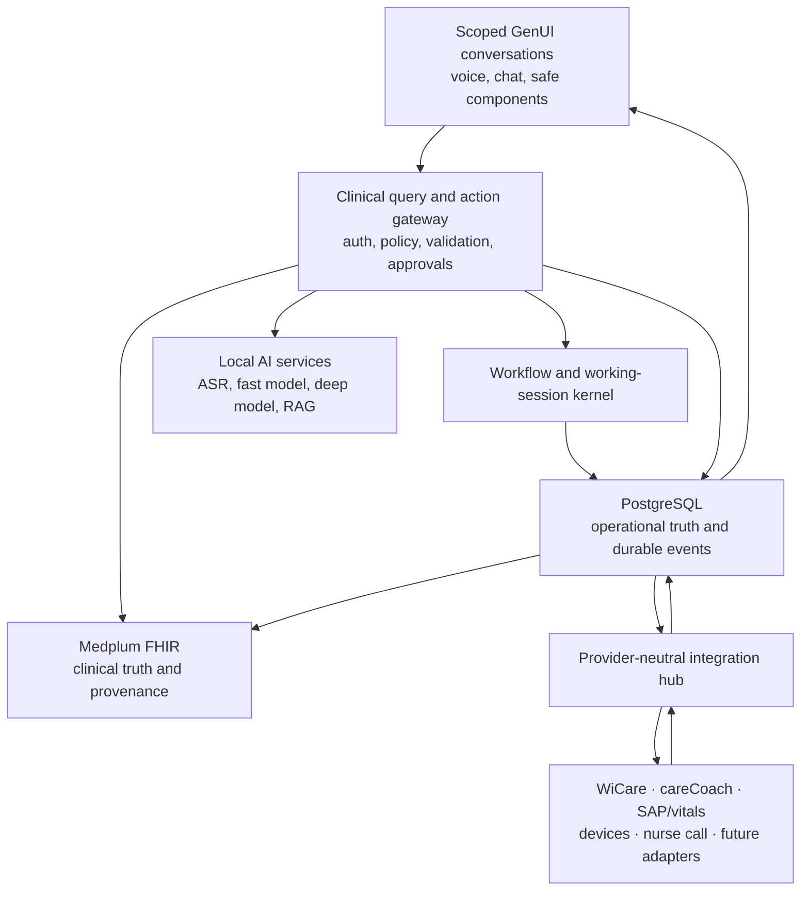

# Pflegehelfer production architecture

Status: canonical architecture and data-ownership boundary
Last verified: 2026-09-20

This is the single architectural source of truth. Product behaviour is in `PRODUCT_EXPERIENCE.md`; configurable journeys are in `WORKFLOWS.md`. ADRs explain decisions but do not override this document.

## Product invariant

> Pflegehelfer is a GenUI/chat/voice-first clinical coworker. One coherent working session links multiple explicitly scoped conversations: the employee's general assistant, private patient-and-encounter assistant threads and separately authorized patient-team/department/direct threads. Handover, patient summaries, tasks, measurements, documentation, team communication, rounds, forms and provider operations appear in the appropriate conversation as contextual, interactive, server-authorized components. Fixed UI is limited to identity, role and patient context, scoped conversation history, contact-style read/query lenses, safety state, synchronization state, authentication and deterministic approval.

There are no workflow-owning dashboard pages or focus modes. The sidebar/drawer recalls an explicitly scoped conversation without ending the working session. Patient tabs are views over the same authorized record and command pipeline; they do not own workflow state. Detailed Medplum screens are an authorized expert escape hatch, not the daily workflow.

The demo organization is **Tertianum Kronenhof · Demo**. Every demo surface states that all people and records are fictional.

## Lean system shape

The deployable baseline is one modular TypeScript backend, one PWA, PostgreSQL, Medplum/PostgreSQL, Redis required by Medplum, and optional local model/ASR runtimes. Flowable, NATS, Kafka, a vector database, Kubernetes and microservices are not baseline dependencies. They require measured need and a new ADR.

### Implemented baseline and remaining target

The current implementation is the OpenUI `AgentInterface` replacement inside the existing PWA, backed by server-owned scoped conversation history, explicit proposal revision/status, one-use approval authority and the PostgreSQL command boundary. The integrated development profile starts PostgreSQL 16, Medplum 5.1.37, Redis and an independent stateful provider simulator. Memory-profile CI is a fast deterministic regression profile and is never evidence that those external stores ran.

The architecture is not yet a production deployment claim. Resource-native reconstruction without a normal checkpoint read, full shared-thread/library/publication behavior, production OIDC and non-bypass tenant isolation, two-replica recovery, real vendor adapters, accepted local/hosted model and audio runtimes, analytics and institutional validation remain completion gates. Their status is maintained in `execution/COMPLETION_MATRIX.md`.

The current value layer has a bounded report calculator and authorized API boundary, not a completed analytics platform. A versioned evaluation definition names the actual comparison alternatives and evidence class. The calculator keeps observed, customer-reported, estimated and synthetic observations separate; includes review, correction, failed-attempt and downstream-reconciliation burden; permits missing baselines and negative outcomes; and never turns released minutes into billing or realized cash savings. Durable event projections, export/UI and the governed publish/pilot/rollback cycle remain G6 work.

Connected-model status has deliberately separate states: configured, reachable, `smoke-tested`, application-scenario accepted and production approved. The smoke path uses the same `ModelGateway.agentAdapter()`, bounded runtime, instructions and authorized tool registry as interactive chat for one nonclinical response and one synthetic read; it never calls the legacy clinical-plan compiler and never treats fallback as success. Full acceptance must still traverse the ordinary server/PWA conversation, durable proposal lifecycle, explicit human action and external read-back. Failures retain only classified, sanitized provider/runtime metadata—never prompts, responses or secrets.

## Ownership and truth

| Concern | Authority | Rule |
|---|---|---|
| Clinical facts | Medplum FHIR | Patient, Encounter, Observation, CarePlan, Goal, clinically material Task/Communication, Provenance and AuditEvent |
| Workflow/session | Pflegehelfer PostgreSQL | Templates, immutable versions, sessions, step instances and progress |
| Conversation | Pflegehelfer PostgreSQL | Threads, sequenced messages and explicit context events |
| Safety authority | PostgreSQL + gateway | Intents, approvals, policy/source versions and one-use receipts |
| Integration delivery | Pflegehelfer PostgreSQL | Inbox, outbox, cursors, receipts, leases and conflicts |
| Live state | PostgreSQL event log | Replayable audience-filtered events; notifications only wake readers |
| AI | Never an authority | May interpret and compose presentation; cannot authorize, approve or invent facts |

The operational workday is the sole live handover and responsibility authority. It owns patient-by-patient acknowledgement, active/paused episodes, defer decisions and receiving-shift receipts. One actor/shift has one authoritative snapshot. Before acknowledgement, deterministic server code binds every assigned patient to the exact authorized encounter and freezes recent changes, currently important facts, today's configured plan and open questions under one cutoff, version and SHA-256 digest. Altered, encounterless or duplicate content is stale and cannot be acknowledged. Imported FHIR/provider documents may be cited as evidence, but they never provide a second mutable or fallback responsibility state.

PostgreSQL must not become a duplicate patient record. It stores operational references, normalized action proposals, minimal replay receipts and projection state. Medplum must not store opaque whole-application checkpoints or actor-owned chat binaries.

## Working sessions and workflows

A `WorkingSession` binds organization/department, authenticated actor and role, one immutable `WorkflowTemplateVersion`, current step/version, lifecycle timestamps and an active-thread pointer. It can link many `AssistantThread`s. Each thread persists organization/site/department, type, owner/audience/membership, patient and encounter where applicable, lifecycle/retention, context revision and ordered messages.

On sign-in the server resumes the open session or starts the institution’s active role workflow. It emits the next safe step into the conversation. Activating a template version never changes a running session.

Workflow definitions are schema-validated data, not code. They contain allowlisted step kinds, completion predicates, role eligibility, prompts, escalation rules and component handles. They cannot contain JavaScript, SQL, URLs, arbitrary expressions/OpenUI, policy grants, approval weakening or provider credentials. Workflow Studio supports draft, validation, preview, immutable publish, deliberate activation, rollback-by-new-version and audit.

Human guidance is loaded from an immutable reviewed directory pack rooted under `config/`: one base instruction plus the exact institution, department, station, actor role and optional workflow skill. Every file is independently SHA-256 pinned in the published manifest and the whole snapshot has a stable digest. The loader rejects path traversal, symlinks, URLs, executable markup, remote includes, policy-override text, invalid UTF-8 and oversized packs. Markdown can guide language and tool selection but cannot grant an action; typed site configuration remains bound to central role ceilings. Actor assignments explicitly name their role profile and station, so policy never depends on directory or manifest order.

Reference journeys:

1. Nursing: sign-in → delta handover → prioritize → select patient → perform/document tasks and alarms → communicate/escalate → review/sign → handover → reconciliation.
2. Physician: addressed questions/round context → patient evidence → answer/decision → owned follow-up → close loop.
3. Allied/operational roles: minimum assigned-work context, explicit patient access where permitted, completion/evidence and escalation.

## One session, scoped conversations and explicit context

An assistant thread contains immutable sequenced messages. Scope changes are server commands that select or create the matching authorized thread, append `ContextChanged` and increment `context_revision`. Patient threads are bound to both patient and encounter. Each response is stored with its origin thread, patient/encounter and revision captured when its request began, even if a slower request completes after a switch. Recent model context is filtered to that authorized scope. Outstanding intents and voice receipts for the old revision become unusable. Useful draft content can be retained but must be revalidated before approval. No hidden model memory crosses patients or private/team audiences.

Sidebar/mobile-drawer entries are context/history controls:

- My assistant: private current working session and next safe actions;
- Patients: explicit private patient-and-encounter conversations plus contact-style record lenses;
- Team: separately authorized shared patient/department discussions with visible authors and audience;
- History: prior authorized scoped sessions/threads;
- Workflow Studio: administration only.

They reuse the same conversation engine and never create a separate dashboard. A private draft becomes shared only through an explicit audience preview and reviewed publish command.

## GenUI and model boundary

The conversation shell uses pinned `@openuidev/react-ui`,
`@openuidev/react-headless` and `@openuidev/react-lang`. Its transport is the
Vercel AI SDK v6 `UIMessage` SSE protocol. The OpenUI `AgentInterface` is
composed inside Pflegehelfer's existing PWA, while a custom `ChatStorage`
adapter loads only the active, already-authorized server thread. Browser-local
history is not an authority. Rendering is progressive over a real HTTP stream;
no timer imitates streaming.

There are two catalogs:

1. **Model presentation catalog** — bounded layout primitives and opaque candidate handles; no intent token, endpoint, patient ID, source version, authorization claim or untrusted clinical fact.
2. **Server renderer catalog** — purpose-built clinical components hydrated from authorized server data. Only this layer can carry executable server-issued authority.

Processing order:

1. Authenticate; resolve organization, role, session, thread, patient context and purpose.
2. Resolve the immutable instruction pack and the actor's explicit role-profile/station/workflow binding.
3. For natural conversation, let one bounded model choose from request-specific typed read tools or the one generic clinical-draft tool, observe each authorized result and either choose another tool or stop. The free-language path has no separate intent-enum call, no last-tool response router and no nested extraction-model call. The model may submit typed meaning and source selectors, but cannot supply identity, patient/encounter authority or provenance: the server captures the exact current request and scope and rebinds exact spans to immutable records. Budgets cap turns, calls, time, repeats and result bytes. SQL, shell, arbitrary HTTP, approval, publish and final-write tools do not exist in the registry.
4. Retain successful tool results in a request-local immutable evidence registry independent of rendered components. The model sees only run-local opaque result handles plus bounded facts and freshness; durable resource IDs, versions, hashes and row provenance stay server-side. Natural text is the default. In the general, non-patient conversation, bounded source-free model wording may be shown as the actual answer. Patient facts, measurements, work state and clinical claims are rendered only from selected exact authorized results. The model may optionally choose a table or chart from the presentation catalog. Deterministic code renders record facts as same-row atoms and hydrates only registered server components from one cited result. Invented/missing references, unsupported claims, executable links/tokens and claims of completed writes fail closed; model-written clinical prose never becomes the clinical fact or evidence authority. Tool results are marked untrusted data and remain thread/patient/encounter scoped.
5. For documentation or work changes, `prepare_clinical_draft` receives a generic typed `AssistantProposal` containing understood facts, work performed, observations, task changes, communications, workflow actions, ambiguities and evidence. Deterministic code independently validates every executable sub-schema, exact source span, negation/currentness, recipient, value/unit and workflow boundary, creates server-owned identifiers/hashes and replaces model-supplied provenance. Restored, reissued and executed durable proposals repeat source/safety validation before authority is honored.
6. Start the Vercel UI stream with non-authoritative progress for actual inference, tool, validation and persistence stages. No executable OpenUI or review authority is exposed during those stages. Validate catalog/bounds/context/evidence/workflow/policy, durably prepare the proposal authority and append the completed response to its exact authorized thread before sending the final renderable frame. Failure or disconnect revokes prepared authority and never produces a successful-looking approval control.
7. Send the final authoritative frame that can open fixed server-controlled review. AI-disabled or failed-agent mode explicitly reports degradation and offers direct records/work controls plus verbatim draft capture; it does not claim general language understanding.

Malformed, incomplete, unsupported or disconnected streams create no intent or clinical mutation. The deterministic direct-record path is a first-class fallback, not a pretend LLM. AI-disabled mode preserves handover, workday and review controls.

## Deterministic safety

“Deterministic” means the same reviewed revision, source/read set and policy version produce the same permitted effect, without a probabilistic model deciding or rewriting a write. It does not mean static, canned or keyword-only conversation.

Faithfulness is an end-to-end record boundary: (1) original employee input and reviewed ASR transcript/corrections, (2) immutable authorized source records with version and occurrence time, (3) model interpretation or optional professional wording, (4) the exact reviewed revision and selected effects, and (5) accepted content plus Medplum/provider mapping versions and receipts. Human approval identifies the reviewed attributed report; it is not independent proof that the event occurred. See ADR-0015.

The model may interpret “Dokumentiere RR 128/76, Mobilisation erledigt und frage den Arzt wegen Schwindel” and arrange a useful multi-card response. The server independently parses/validates every candidate, checks access/source versions, shows an exact diff and only then creates selected note/Observation/Communication objects. The model cannot prescribe, diagnose, sign, approve, implicitly select a patient, choose provider capability or bypass review.

Every executable intent is one-use, short-lived, stored as a cryptographic hash, and bound to organization, actor, role, purpose, patient/encounter, session/thread, workflow version/step, context revision, proposal hash, policy version and resource versions. The integrated profile now consumes authority and accepts a reviewed assistant command, receipt, audit entries, matching episode evidence, recovery checkpoint, domain event, resource-scoped Medplum projection job and provider jobs in one PostgreSQL transaction. External calls remain outside that transaction. This is the canonical path for reviewed assistant writes; the legacy checkpoint outbox copy is retired immediately after acceptance and its manual processor is disabled in the integrated profile. Direct non-assistant clinical mutation routes fail closed until they migrate to this boundary. Resource-native restart reconstruction has not completed, so G1 remains partial.

Normal note/measurement review produces a locally approved record whose external acknowledgement remains visible. A clinically doubtful measurement uses `high-assurance`: the first review only creates a reviewed record, current-vitals queries exclude it, and a reachable independent countersignature is required before provider delivery. Episode and linked-task completion evidence is a separate trust boundary: deterministic code derives it only from current, certain structured work spans and independently accepted observations, never from the surrounding free-text note. A mixed note therefore cannot launder a pending high-assurance value into completable work evidence.

High-risk/irreversible actions use purpose-built review forms. Medication support remains read-only/communication-oriented until separately governed.

The `AssistantProposal` compiler is the language-normalization boundary: **conversational outside, structured inside**. Staff never sees proposal/schema terminology or a form wizard. The assistant responds like a coworker, uses current patient/workflow/session context, asks at most one concise blocking question, then renders only the minimum useful review controls. One utterance may contain several observations, partial work, deferral, communication or an interruption, but only explicitly requested executable changes receive authority. Negated, historical, refused, uncertain and corrected statements remain distinct. The compiler never supplies a default follow-up or silently converts documentation into a performed or billable service. Medication, treatment and diagnostic commands fail closed into separately governed workflows. See ADR-0008.

Ambiguous administration language such as `geben` is rejected by generic free-text task creation even when padded with basic-care words; unambiguous support verbs remain available. When a staff member approves note/observation evidence for the patient and encounter of an active work episode, locally approved evidence is added to the episode draft only after clinical-workspace acceptance. High-assurance observations still awaiting independent review are excluded. Reuse is not an automatic completion, billing claim or provider acknowledgement.

## Interruptible nursing workday

The nursing conversation begins with an authorized, actor-owned, versioned patient-level incoming handover. Each row visibly separates “Seit letzter Übergabe”, “Aktuell wichtig”, “Heute geplant” and “Offene Fragen” and is encounter-bound before it can be acknowledged. Acknowledgements bind the exact handover ID/version, actor and frozen clinical plus assignment content. The deterministic readout is generated from that same snapshot; browser speech is synthetic-demo only, while production TTS uses the governed local adapter. Every patient context is independently checked before the plan opens. Starting care creates a patient/encounter-bound work episode; one planned responsibility can have only one episode, while alarms/spontaneous visits are explicit separate episodes. An interruption pauses the original episode and leaves an explicit return path. Segment timing excludes interruptions. Terminal episodes cannot be resumed or edited. Completion requires current, certain evidence recognisably bound to the exact activity; measurements and ambiguous text return to proposal review. Shift transfer is blocked until every active or paused responsibility is resolved. A transferred shift is final. The outgoing handover and provider reconciliation remain separate acknowledgements; neither is implied by local documentation.

The outgoing transfer is only complete when the configured receiving actor acknowledges the durable receipt. “Sent” and “accepted” are distinct UI states. Role-addressed communication likewise stays in the role queue until an authorized person claims or answers it; user-list order never selects a recipient.

## Command transaction and projection

One accepted command transaction writes intent consumption/idempotency receipt, workflow/session mutation, approval/action record, append-only audit metadata, domain event and FHIR/provider outbox row. The response distinguishes **accepted locally / synchronization pending** from **acknowledged externally**. External calls never occur inside the transaction.

Workers claim rows with bounded leases and `FOR UPDATE SKIP LOCKED`, stable idempotency keys, classified errors, exponential backoff and terminal/manual poison state. Every leased provider command carries its immutable acceptance-time actor/purpose/policy/proposal/context envelope and passes current role, policy and care-relationship authorization; revoked or unverifiable authority enters manual hold before an adapter is called. A crashed lease expires safely. The Medplum worker re-reads acceptance-time resource versions, treats an already-matching projection as lost-response recovery, uses version-aware updates and quarantines a changed non-matching record. Provider simulators enforce expected versions. Medplum and provider acknowledgements are later transactions and are terminal only after resource read-back matches the intended record. Both relational workers start with the normal integrated application process. A manual projection or provider outcome moves the parent accepted command to `manual-review`; an acknowledgement alone is never treated as proof of remote state.

Inbound processing persists an authenticated size-bounded envelope before mapping. Unique provider/profile/external-id/version-or-hash keys deduplicate. Poison events are quarantined without blocking later events. Cursor advancement, receipt/conflict state and domain-event append are atomic after projection evidence exists.

## Provider honesty

Adapters implement the versioned provider-neutral contract and declare capabilities per operation. Simulators cover WiCare-, careCoach-, SAP/vitals-, device- and nurse-call-shaped behaviour without claiming proprietary compatibility. Production operations remain `EXTERNAL_VENDOR_GATE` until exact contracts, auth, sandbox credentials, mapping examples, error semantics and acceptance evidence exist. One gated operation never disables independently verified operations.

## Live events and proactive work

Domain events are durable PostgreSQL rows with monotonic IDs, organization, audience metadata, event type and minimal payload. SSE accepts `Last-Event-ID`, reauthorizes every replay/delivery and supports restart/replica handoff. Payloads are opaque references where possible; clients perform an authorized projection fetch. Retention gaps produce explicit reset/refetch.

Provider acknowledgements/conflicts, alarms, physician replies, mentions and workflow changes can appear in the active thread without dashboard refresh. Slow consumers reconnect by cursor.

## Authentication, privacy and tenancy

Production never accepts demo identity headers. OIDC sessions use secure HttpOnly SameSite cookies, CSRF protection and short lifetimes. Deny-by-default authorization combines role, purpose, organization/department, assignment/treatment relationship, state and ownership on every read, retrieval, event and mutation.

Every operational row has non-null `organization_id`; composite tenant keys/repository predicates are mandatory, with PostgreSQL RLS as defense in depth. DTOs are allowlisted per role, never broad objects followed by field removal.

FHIR resource IDs and managed-resource tags include institution/site, and cleanup requires both tenant and data-classification tags. Legacy unscoped state is default-denied and may be migrated only with an explicit active-site plus approved Binary-digest manifest. Site workflow configuration may narrow, never expand, a centrally reviewed action ceiling.

Prompts, transcripts, notes, names/MRNs, provider payloads, tokens and clinical responses never enter logs or analytics. Raw audio is memory-only. Conversation, audit, clinical and analytics retention are separate. Analytics is bounded/aggregated with small-cell suppression and is not worker ranking.

## Clinical UI and accessibility

The visual language is calm white/black/deep blue with red for safety. It supports system/light/dark themes, 44px targets, keyboard operation, visible focus, reduced motion, semantic landmarks and WCAG 2.2 AA contrast. Mobile shows one feed and a drawer—no module tab bar. Tablet/desktop add whitespace/sidebar, not workflow ownership.

The light and dark files in `design/reference/` are visual-direction references, not data fixtures or clinical requirements. Their hierarchy, spacing, conversation rhythm, compact context switcher and restrained theme treatment guide the shell. Unsupported status statements, measurements, patient identity, reassurance, actions and branding details in those images must never be copied into runtime behavior. Record-backed truth and the safety boundaries above always override visual imitation.

Patient safety context shows name, birth date, encounter/MRN and permitted warnings before patient actions. Offline/degraded states are explicit; clinical approval is never silently queued from an offline browser.

## Deployment and air gap

Runtime images, packages, models and terminology artifacts are immutable and mirrored for disconnected deployment. Egress is deny-by-default. Production AI endpoints are allowlisted local origins. Secrets come from a secret manager. PostgreSQL/Medplum have encrypted backups, tested PITR/restore, key rotation and least-privilege roles.

Readiness fails closed without operational PostgreSQL, governed Medplum or production identity. AI/provider outages degrade only the dependent capability and remain visible.

## Definition of done

- one coherent working session with persistent general, patient-private and authorized shared conversations, explicit patient/encounter scope and no dashboard/focus application;
- versioned configurable workflows and resumable working sessions;
- real streamed bounded OpenUI with server-hydrated authority and safe partial failure;
- typed multi-action draft/review/approval with source/version checks;
- durable PostgreSQL commands, threads, events, intents, approvals, voice receipts, inbox/outbox/cursors/receipts/conflicts;
- Medplum clinical FHIR/provenance without an application checkpoint binary;
- provider simulators/contract tests and honestly gated undocumented operations;
- synthetic nursing, physician and reconciliation journeys;
- mobile/tablet/desktop, keyboard/accessibility, offline/reconnect and SSE replay validation;
- clean-checkout format, lint, typecheck, unit/integration, security, ops, build and browser suites;
- evidence-backed development, deployment, security, operations, safety and validation docs.

Anything short is reported as a limitation, never relabeled production-complete.
