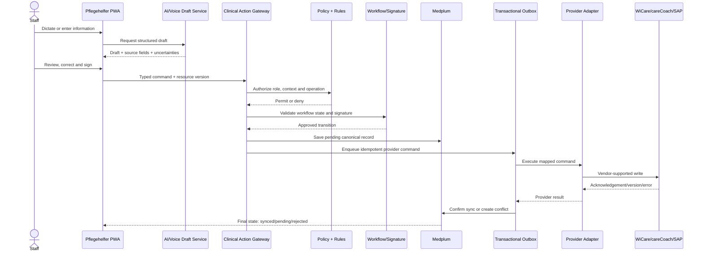
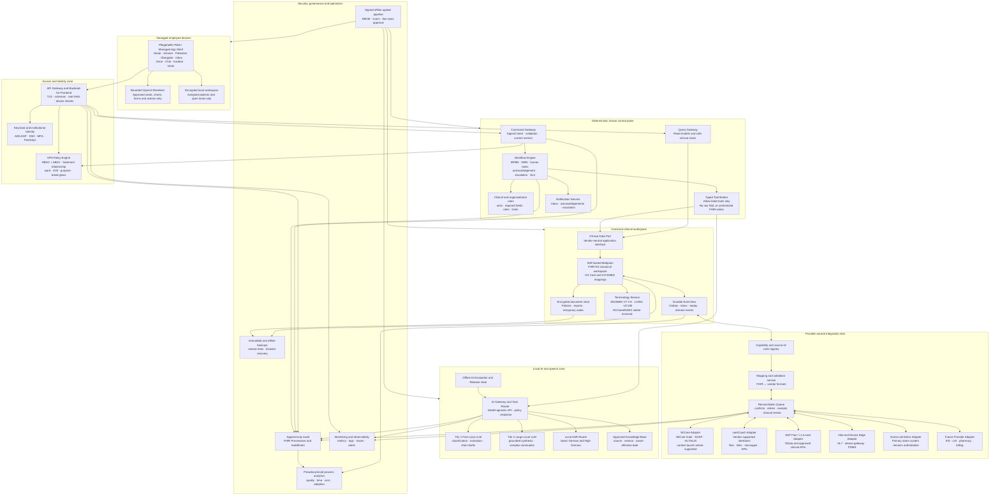

# Pflegehelfer — production reference architecture

**Architecture baseline: 4 September 2026**

## Executive decision

Your proposed direction is correct, but the production architecture should **not** be:

```text
Chat UI → Local LLM → Medplum ↔ WiCare/careCoach
```

It should be:

```text
GenUI conversation + voice-first clinical PWA
                    │
                    ▼
       Clinical Query and Action Gateway
                    │
        ┌───────────┴───────────┐
        ▼                       ▼
Workflow / Rules / Policy     Local AI services
        │                    Voice + Fast LLM
        │                    + Deep LLM + RAG
        ▼                       │
     Medplum FHIR ◄─────────────┘
   operational workspace
        │
        ▼
 Provider-neutral Integration Hub
        │
  ┌─────┼──────────────┬──────────────┐
  ▼     ▼              ▼              ▼
WiCare careCoach  SAP/Fiori or     New systems
                  vital gateway    later
```

The critical boundaries are:

* **Medplum is the normalized FHIR workspace, not automatically the master of every record.**
* **Each data field has exactly one designated source of truth.**
* **OpenUI generates presentation, not authority.**
* **The LLM can read through controlled tools and create drafts, but never writes directly to Medplum or a provider.**
* **Clinical writes pass through permissions, deterministic checks, human review, workflow state and provider acknowledgement.**
* **The core application remains usable when the AI is unavailable.**

## Product experience invariant

**Pflegehelfer is GenUI/chat/voice-first: the conversation stream is the
primary workspace, and tasks, patient summaries, vitals, documentation,
Übergabe, Visite, forms and provider actions materialize contextually as
approved interactive GenUI components. Fixed UI exists only for patient/role
context, navigation/history, safety, authentication, synchronization state and
deterministic approvals.**

“Conversation-first” does not mean an unstructured chatbot or direct model
access to clinical systems. Deterministic shift events, nurse-call mirrors,
provider acknowledgements and team messages enter the same stream as user
questions. Every generated action is a typed, bounded draft; normal code owns
authorization, validation, workflow transitions, human approval, audit,
Medplum persistence and provider commands. The product therefore feels like one
natural-language coworker without weakening the trust boundaries below.

This invariant supersedes later examples in this historical architecture that
describe permanent `Heute / Zimmer / Patienten / Übergabe / Inbox` pages. Those
capabilities remain, but appear as contextual stream modes and interactive
components rather than independent dashboard modules.

This makes Pflegehelfer a **clinical workflow and interoperability layer** that improves WiCare, careCoach and connected systems instead of becoming another isolated documentation application.

---

# 1. Provider compatibility

## WiCare

WiCare is the strongest initial integration candidate. Its current documentation explicitly describes:

* HL7-oriented integration,
* the configurable **WiCare|Gate** interface module,
* **WiCare|SOAP** web services,
* complete data export,
* context-sensitive launch through URI/DDE,
* structured data storage,
* redundant installations and a downtime concept.

WiCare also already covers tasks, appointments, physician questions, BESA assessments, care planning and care documentation. ([WigaSoft][1])

Therefore, the **WiCare adapter** should support several modes:

```text
WiCare|SOAP        → structured read/query integration
WiCare|Gate        → configured inbound/outbound exchange
HL7                → events and clinical messages where available
URI context launch → open the correct WiCare patient/module
Full export        → migration, reconciliation and reporting
```

What still must be obtained from WigaSoft before implementation:

* WSDL and SOAP schemas,
* WiCare|Gate specifications,
* supported HL7 versions and message types,
* authentication method,
* event versus polling support,
* write permissions by module,
* concurrency/versioning behavior,
* test environment,
* licensing and support conditions.

Direct database writes must remain prohibited even though WiCare describes a readable data model. Database access could be used only through a vendor-approved read replica or export agreement.

## careCoach

careCoach already provides mobile and offline documentation with automatic synchronization, modular interfaces and Swiss-hosted AI-supported speech reformulation. Therefore, Pflegehelfer should not simply rebuild its existing mobile documentation and voice features. It should concentrate on cross-system workflow, unified communication, reconciliation, handover and natural-language access. ([TopCare][2])

I could not verify a publicly documented generic FHIR or REST write API in careCoach’s current public documentation. Consequently:

* start with vendor-approved read/export interfaces;
* use contextual launch where available;
* enable write-back only after topCare supplies a documented contract and test environment;
* never use browser automation against the careCoach interface as the normal production integration.

## “Firoli”

I could not verify a healthcare product called **Firoli** matching your description. Based on “vital data, edge and SAP,” the likely term is **SAP Fiori**, or a device/edge solution surfaced through SAP Fiori.

That distinction matters because SAP Fiori is primarily the user-facing application layer. SAP’s official architecture states that Fiori applications obtain their backend business data through SAP Gateway/OData services. Pflegehelfer should therefore integrate the underlying OData/API, device gateway or SAP service—not scrape or automate the Fiori screen. ([SAP Help Portal][3])

Until the exact product is identified, this connector should be named:

```text
sap-vitals-adapter
```

with several possible drivers:

```text
SAP Gateway / OData
HL7 v2 ORU messages
FHIR Observation
Device vendor REST API
Edge gateway message stream
Approved database view or file exchange
```

---

# 2. Complete logical architecture

```mermaid
flowchart TB
    subgraph EXPERIENCE["1. Staff experience"]
        DEVICE["Managed smartphone, tablet or workstation"]
        APP["Pflegehelfer PWA<br/>optional managed native shell"]
        SHELL["Minimal safety shell<br/>identity · patient · sync · history · approvals"]
        GENUI["Primary GenUI conversation stream<br/>tasks · vitals · notes · team · handover · rounds"]
        VOICEUI["Push-to-talk voice input<br/>explicit patient and workflow context"]

        DEVICE --> APP
        APP --> SHELL
        APP --> GENUI
        APP --> VOICEUI
    end

    subgraph EDGE["2. Secure application edge"]
        PROXY["Reverse proxy / API gateway<br/>TLS · device policy · rate limits"]
        BFF["Clinical Backend-for-Frontend<br/>minimal purpose-specific APIs"]
        IAM["Enterprise IdP / Keycloak<br/>SSO · MFA · passkeys · AD/LDAP"]
        POLICY["Policy Decision Point<br/>RBAC + ABAC + purpose of use"]
        SESSION["Context service<br/>facility · ward · shift · role<br/>patient relationship"]

        APP --> PROXY
        PROXY --> BFF
        BFF --> IAM
        BFF --> POLICY
        BFF --> SESSION
    end

    subgraph CONTROL["3. Deterministic clinical control plane"]
        QUERY["Clinical Query Service<br/>read models and patient context"]
        ACTION["Clinical Action Gateway<br/>typed commands only"]
        WORKFLOW["Workflow Engine<br/>BPMN · human tasks · deadlines<br/>acknowledgements · escalation"]
        RULES["Rules and Validation Engine<br/>permissions · units · required fields<br/>state transitions · duplicate checks"]
        TASKS["Task and Communication Service<br/>Kanban · comments · assignments"]
        SIGN["Review and Signature Service<br/>draft → reviewed → signed"]
        OUTBOX["Transactional Outbox / Inbox<br/>idempotency · retries · dead-letter queue"]
        BUS["Durable Event Bus<br/>NATS JetStream baseline"]

        BFF --> QUERY
        BFF --> ACTION
        ACTION --> POLICY
        ACTION --> RULES
        ACTION --> WORKFLOW
        ACTION --> SIGN
        WORKFLOW --> TASKS
        ACTION --> OUTBOX
        OUTBOX --> BUS
    end

    subgraph AI["4. Isolated AI assistance plane"]
        AIGW["AI Gateway and Model Router<br/>task risk · model policy · version pinning"]
        TOOLS["Typed Clinical Tool Broker<br/>read tools and draft tools only"]
        FAST["Fast local LLM<br/>intent · extraction · drafting · GenUI"]
        DEEP["Large local reviewer LLM<br/>complex summaries · consistency review"]
        ASR["Local speech recognition<br/>Swiss-language evaluation profile"]
        KB["Approved Knowledge Service<br/>policies · SOPs · guidelines<br/>owner · version · valid-from/to"]
        GUARD["Schema and Evidence Validator<br/>citations · tool result binding<br/>unsupported-claim rejection"]
        EVAL["Offline Evaluation Registry<br/>golden cases · model cards<br/>approval · canary · rollback"]

        BFF --> AIGW
        VOICEUI --> ASR
        AIGW --> TOOLS
        AIGW --> FAST
        AIGW --> DEEP
        TOOLS --> QUERY
        TOOLS --> KB
        FAST --> GUARD
        DEEP --> GUARD
        GUARD --> BFF
        EVAL --> AIGW
    end

    subgraph CLINICALDATA["5. Canonical clinical data plane"]
        MEDPLUM["Self-hosted Medplum<br/>FHIR R4 operational workspace"]
        VALIDATOR["Swiss FHIR Validation Service<br/>pinned CH Core packages"]
        TERMINOLOGY["Terminology Service<br/>SNOMED CT CH · UCUM · LOINC<br/>licensed medication content"]
        OBJECTS["Encrypted object store<br/>documents · transient audio"]
        PROVENANCE["FHIR Provenance and AuditEvent"]
        RECON["Reconciliation Workbench<br/>conflicts · pending writes · rejected records"]

        QUERY --> MEDPLUM
        ACTION --> MEDPLUM
        MEDPLUM --> VALIDATOR
        VALIDATOR --> TERMINOLOGY
        MEDPLUM --> PROVENANCE
        ACTION --> PROVENANCE
        ASR --> OBJECTS
    end

    subgraph INTEGRATION["6. Provider-neutral integration layer"]
        REGISTRY["Provider Registry<br/>capabilities · versions · ownership"]
        MAPPER["Anti-corruption and Mapping Layer<br/>provider model ↔ canonical FHIR"]
        HUB["Integration Runtime<br/>events · polling · batch · commands"]
        ADAPTERSDK["Versioned Adapter SDK<br/>contract tests and simulations"]

        BUS --> HUB
        HUB --> REGISTRY
        HUB --> MAPPER
        HUB --> ADAPTERSDK
        HUB --> RECON
        MAPPER --> VALIDATOR
        MAPPER --> MEDPLUM
    end

    subgraph PROVIDERS["7. Existing and future systems"]
        WICARE["WiCare adapter<br/>Gate · SOAP · HL7 · export · URI"]
        CARECOACH["careCoach adapter<br/>approved vendor interfaces"]
        SAP["SAP/Fiori or vital-data adapter<br/>OData · HL7 · FHIR · device API"]
        CALL["Nurse-call adapter<br/>secondary workflow event only"]
        FUTURE["Future adapters<br/>KIS · PDMS · laboratory · pharmacy<br/>roster · billing · insurers"]

        HUB <--> WICARE
        HUB <--> CARECOACH
        HUB <--> SAP
        HUB <--> CALL
        HUB <--> FUTURE
    end

    subgraph OPERATIONS["8. Operations, audit and improvement"]
        OBS["OpenTelemetry observability<br/>metrics · logs · traces · alerts"]
        AUDIT["Append-only audit archive<br/>tamper-evident and access-controlled"]
        ANALYTICS["Pseudonymized process warehouse<br/>time · quality · cost · adoption"]
        IMPROVE["Improvement Hub<br/>PDSA · workflow versions · staff feedback"]
        RELEASE["Offline release repository<br/>signed images · SBOM · model packs<br/>FHIR packages · rollback"]
        BACKUP["Immutable backup and recovery<br/>PITR · offline copy · restore tests"]

        BFF --> OBS
        WORKFLOW --> OBS
        HUB --> OBS
        AIGW --> OBS
        PROVENANCE --> AUDIT
        BUS --> ANALYTICS
        ANALYTICS --> IMPROVE
        RELEASE --> APP
        RELEASE --> HUB
        RELEASE --> AIGW
        MEDPLUM --> BACKUP
        OBJECTS --> BACKUP
    end
```



---

# 3. Medplum’s exact role

Medplum should be the **canonical operational interoperability workspace**, consisting of:

1. normalized FHIR projections of data held in existing systems;
2. Pflegehelfer-native workflow and communication objects;
3. provenance and synchronization state;
4. a stable API for the PWA and AI tool layer.

It should **not** silently become the source of truth for every copied field.

Medplum officially supports self-hosting across Kubernetes, Ubuntu, Docker and other environments, and provides access policies capable of restricting read and write access by resource and field. Its subscriptions can emit events when FHIR resources change. However, its own documentation correctly assumes experienced production healthcare operations; air-gapped packaging and validated upgrades must be implemented as an additional Pflegehelfer distribution layer. ([medplum.com][4])

## Source-of-truth matrix

Every installation receives an explicit, version-controlled matrix:

| Information domain             | Initial authority                           | Medplum role                           | Write rule                                                        |
| ------------------------------ | ------------------------------------------- | -------------------------------------- | ----------------------------------------------------------------- |
| Patient identity and insurance | SAP/ERP/KIS or designated master            | Normalized projection                  | Changes go to administrative master first                         |
| Admission, room and bed        | ADT/KIS/WiCare/careCoach, depending on site | Current operational projection         | No competing room updates                                         |
| Nursing care plan              | WiCare or careCoach                         | Searchable FHIR representation         | Write through the selected provider adapter                       |
| Nursing notes                  | WiCare or careCoach                         | Draft, projection and provenance       | Human signature plus provider acknowledgement                     |
| Vital measurements             | Device/edge/PDMS or approved manual entry   | FHIR `Observation`                     | Preserve device, unit, time and measurement origin                |
| Medication orders              | Existing medication/KIS/eMAR system         | Primarily read-only projection         | No Pflegehelfer order changes in the MVP                          |
| Medication administration      | Existing eMAR                               | Read-only or approved capture workflow | Provider-specific and role-restricted                             |
| Cross-team tasks               | Pflegehelfer Workflow Service               | FHIR `Task` projection                 | Pflegehelfer is authoritative                                     |
| Patient-linked messages        | Pflegehelfer Communication Service          | FHIR `Communication`                   | Pflegehelfer is authoritative; relevant summaries may be exported |
| Übergabe acceptance            | Pflegehelfer                                | Structured handover plus signatures    | Outgoing sign and incoming acknowledgement                        |
| Visite decisions               | Authorised clinician/provider system        | Drafted and tracked in Pflegehelfer    | Final order only through authorised clinical system               |
| Staff roster                   | SAP/HR/planning system                      | Minimal operational projection         | HR remains authoritative                                          |
| Process analytics              | Derived analytics warehouse                 | Not part of clinical master data       | Never written back as clinical facts                              |

This matrix can differ between institutions without changing the PWA or AI architecture.

## Swiss FHIR baseline

The current non-ballot publication is **CH Core 6.0.0 (STU 6)**, published 16 December 2025. **CH Core 7.0.0-ballot**, generated 10 June 2026 against FHIR R4 4.0.1, is a compatibility target rather than a production baseline. Pflegehelfer therefore pins 6.0.0 for the reference mapping and evaluates 7.0.0-ballot separately before any governed promotion. ([FHIR.ch][5])

Principal resources include:

```text
Patient                 Encounter / EpisodeOfCare
Location                Practitioner / PractitionerRole
CareTeam                CarePlan / Goal
Task                    Communication / CommunicationRequest
Observation             Device
Questionnaire           QuestionnaireResponse
Condition               AllergyIntolerance
MedicationRequest       MedicationStatement
MedicationAdministration / MedicationDispense
ServiceRequest          Procedure
DocumentReference       Composition / Binary
Consent                 Coverage / Claim
Provenance              AuditEvent
```

Structured facts should be represented as structured resources. A narrative note can accompany them, but it should not be the only representation of a blood pressure, temperature, medication administration or task.

---

# 4. Modular adapter architecture

## Adapter contract

Every provider connector implements the same contract:

```ts
export interface PflegehelferProviderAdapter {
  manifest(): AdapterManifest;

  discoverCapabilities(): Promise<CapabilitySet>;

  health(): Promise<AdapterHealth>;

  pullChanges(cursor?: SyncCursor): Promise<ChangeBatch>;

  read(reference: ExternalReference): Promise<ExternalRecord>;

  prepareCommand(
    command: CanonicalClinicalCommand
  ): Promise<PreparedProviderCommand>;

  executeCommand(
    command: PreparedProviderCommand
  ): Promise<ProviderAcknowledgement>;

  reconcile(
    idempotencyKey: string
  ): Promise<ReconciliationResult>;

  exportSnapshot?(
    request: ExportRequest
  ): Promise<ExportResult>;
}
```

The capability response is field- and operation-specific:

```json
{
  "provider": "wicare",
  "version": "site-specific",
  "capabilities": {
    "Patient.read": true,
    "Encounter.read": true,
    "Observation.read": true,
    "Observation.write": "requires-module-confirmation",
    "NursingNote.read": true,
    "NursingNote.write": "requires-human-signature",
    "Task.write": false,
    "realtimeEvents": "unknown",
    "bulkExport": true,
    "contextLaunch": true
  }
}
```

The PWA must not assume that every provider supports the same functions. It asks the capability registry what is available and changes the interface accordingly.

For example:

```text
Provider supports write:
    Review and sign → write → provider acknowledgement

Provider supports read only:
    Review → copy/export/launch provider context

Provider temporarily unavailable:
    Signed pending record → encrypted outbox
    visible as “not yet synchronized”

Provider rejects record:
    Reconciliation task for authorised staff
```

## Anti-corruption layer

Provider-specific concepts stay inside the adapter:

```text
WiCare BESA field
        │
        ▼
WiCare mapping package
        │
        ▼
Canonical Pflegehelfer/FHIR representation
```

The application must never contain code such as:

```ts
if (provider === "wicare") {
  // UI-specific behavior
}
```

Instead, it works with canonical capabilities and commands:

```ts
clinicalActions.recordObservation(...)
clinicalActions.draftNursingNote(...)
clinicalActions.createCommunication(...)
clinicalActions.completeTask(...)
```

## No uncontrolled “bidirectional sync”

Full database mirroring would create loops, conflicts and ambiguous responsibility. Use **event replication plus explicit commands**.

### Inbound flow

```text
Provider event/export/poll
    → authenticated adapter inbox
    → deduplication
    → patient/encounter identity matching
    → provider-to-FHIR mapping
    → CH profile and terminology validation
    → Medplum transaction
    → Provenance record
    → internal event
    → PWA/workflow update
```

### Outbound flow



Every event carries:

```text
eventId
originSystem
originRecordId
originVersion
correlationId
causationId
patient/encounter reference
mappingVersion
receivedAt
recordedAt
effectiveAt
idempotencyKey
```

That prevents update loops and allows forensic reconstruction.

---

# 5. User experience: GenUI conversation first, fixed safety shell

The interface is one context-aware conversation stream, not a blank chatbot and
not a conventional module dashboard with AI bolted on. Predictability comes
from a fixed composer, patient/role banner, compact stream modes, approved
component catalog, stable action placement and deterministic approval sheets.

## Fixed safety and context controls

Only the following controls remain permanently fixed:

```text
authenticated person and active role
ward/shift and selected patient context
conversation history/back navigation
online/offline and pending synchronization state
push-to-talk and text composer
explicit approval/signature and break-glass controls
```

Patient context opens from a room, assignment, task, search, QR code or NFC identifier.

The persistent patient banner displays:

* two approved patient identifiers,
* room and encounter,
* current role/context,
* major allergies and risks,
* offline/synchronization state,
* source and update time.

The stream can be focused with compact in-chat modes such as **My Shift**,
**Patient**, **Team** and **Synchronization**. These change which deterministic
events and components are materialized; they are not separate legacy pages.

## Contextual stream workspaces

### My Shift stream

```text
Incoming Übergabe
Assigned patients
Urgent and overdue tasks
Unacknowledged messages
Physician/therapy questions awaiting response
Recent changes
Synchronization problems
```

### Patient stream

```text
Current risks and relevant context
Open tasks
Recent changes
Vitals
Care goals
Current questions
Quick actions
Timeline
```

### Tasks

Kanban views should be available but secondary to a focused personal worklist:

```text
New → Accepted → In progress → Waiting → Completed
                                 └──────→ Escalated
```

Every task includes:

```text
patient
requester
owner/team
priority
deadline
reason
workflow
acknowledgement requirement
comments
source
completion evidence
```

### Inbox

This is not a generic chat room. Every clinically relevant conversation is linked to:

* patient and encounter,
* question or requested action,
* recipient or team,
* priority,
* deadline,
* acknowledgement status,
* escalation path.

### Übergabe

The system shows **changes since the last accepted handover**, not an indiscriminate copy of the entire record:

```text
New clinical observations
Changed care goals
Changed orders or medication information
Unresolved questions
Open or overdue tasks
Events and exceptions
Planned appointments
Items requiring explicit acknowledgement
```

The deterministic query produces the delta. The LLM may create a concise SBAR narrative, but every statement remains linked to its underlying record.

### Visite

The visit workspace contains:

```text
Goals and current problems
Relevant trends
Open questions from nursing/therapy/pharmacy
Pending decisions
Discharge barriers
Previous decisions and completion status
```

During or after the visit, decisions become structured drafts:

```text
Decision
Owner
Deadline
Required confirmation
Related patient/goal
Target system
```

A signed decision may become a `Task`, `ServiceRequest`, `CommunicationRequest` or provider-specific order. It must not disappear inside a transcript.

---

# 6. Safe use of OpenUI

The current OpenUI implementation provides React packages, streaming OpenUI Lang, typed component definitions and a model-independent renderer. Its current repository is MIT licensed. OpenUI’s own architecture limits the model to composing registered components rather than executing arbitrary code. ([OpenUI][6])

Use the current packages rather than coupling the product to a hosted Thesys cloud path:

```text
@openuidev/lang-core
@openuidev/react-lang
@openuidev/react-headless
@openuidev/react-ui
```

## Approved clinical component catalog

```text
PatientContextBanner
SourceAndTimestamp
RiskChip
TaskCard
TaskBoard
CommunicationCard
AcknowledgementCard
HandoverDelta
SBARCard
VitalTrend
ObservationTable
CareGoalCard
VisitDecisionDraft
PhysicianQuestionDraft
NoteDraftReview
TranscriptComparison
ConflictResolutionCard
SyncStatus
PolicyCitation
WorkflowForm
EmptyOrUnknownState
```

## Components the model must never generate

```text
Password or authentication form
Arbitrary HTML or JavaScript
External URL action
Medication order confirmation
Dose-change confirmation
Break-glass access dialog
Consent signature
Clinical alert suppression
Patient merge
Record deletion
Final clinical signature
HR disciplinary action
```

Those are fixed, manually designed and independently tested workflows.

## Signed intent actions

A generated button must never contain a direct API route such as:

```text
POST /fhir/MedicationRequest
```

Instead it carries a short-lived server-issued intent:

```json
{
  "intentId": "draft-physician-question",
  "patient": "Patient/123",
  "encounter": "Encounter/456",
  "allowedAction": "create-draft",
  "user": "Practitioner/789",
  "resourceVersion": "18",
  "expiresAt": "2026-09-04T18:15:00+02:00"
}
```

The Action Gateway independently revalidates:

* identity,
* role,
* patient relationship,
* ward and shift,
* current resource version,
* workflow state,
* expiry and nonce,
* required human confirmation.

## Correct handling of the Torasemide example

A nurse saying:

> “Increase Torasemide from 5 mg to 10 mg.”

must **not** receive a simple AI-generated “Confirm order” button.

The safe response is:

1. display the current medication record and source;
2. clarify that the request requires an authorised prescriber;
3. generate a structured physician question or draft proposal;
4. route it to the responsible physician;
5. let the physician use a fixed, validated medication-order screen;
6. run deterministic medication and authorization checks;
7. capture the physician’s signature;
8. write through the authoritative medication system;
9. require provider acknowledgement and reconciliation.

---

# 7. AI and voice architecture

## Two LLM layers plus a deterministic layer

The best solution is actually **three levels**:

| Level                   | Technology                                        | Suitable work                                                                                          | Not suitable                                   |
| ----------------------- | ------------------------------------------------- | ------------------------------------------------------------------------------------------------------ | ---------------------------------------------- |
| **0. Deterministic**    | Rules, FHIR queries, SQL, workflow state machines | permissions, timers, task escalation, vital units, duplicate detection, deltas, calculations           | narrative generation                           |
| **1. Fast local model** | Ministral 3 14B baseline                          | intent classification, note drafting, structured extraction, translation, OpenUI generation, short Q&A | final clinical decisions                       |
| **2. Deep local model** | Mistral Small 4 119B or benchmarked gpt-oss-120b  | complex record synthesis, consistency checking, long documents, management analysis                    | autonomous diagnosis, prognosis or prescribing |

### Fast model recommendation

**Ministral 3 14B Instruct** is a strong initial baseline because its official model card describes:

* local deployment in 24 GB VRAM in FP8,
* further reduction through quantization,
* German, French and Italian support,
* native function calling and JSON output,
* Apache 2.0 licensing,
* a 256k context window. ([Hugging Face][7])

Use it for:

```text
voice transcript → structured note draft
natural-language query → typed read tools
tool result → concise answer
tool result → OpenUI component stream
handover data → draft narrative
message → recipient/task classification
```

### Deep model recommendation

The first deep-model candidate should be **Mistral Small 4 119B A6B** because it supports configurable reasoning, function calls, text and image input, German/French/Italian and Apache 2.0 licensing. It has 119 billion total parameters but activates approximately 6.5 billion per token, so it should run on a dedicated central GPU service rather than every ward appliance. ([Hugging Face][8])

A strong comparison candidate is **gpt-oss-120b**, which OpenAI documents as a 117-billion-parameter open-weight model with 5.1 billion active parameters, structured outputs, configurable reasoning and the ability to fit on one H100-class GPU. It is text-only, so it is less suitable for document-image workflows but useful as an independent reasoning benchmark. ([OpenAI Developers][9])

The final selection must come from a local benchmark, not general leaderboards.

## No general-LLM prognosis

A larger LLM does not make prognosis medically reliable.

For prediction or prognosis:

```text
validated outcome-specific algorithm
        │
        ▼
regulated calculation service
        │
        ▼
human clinical interpretation
        │
        ▼
LLM may explain the result and sources
```

Diagnosis, prognosis, triage and treatment recommendation should remain outside the initial Pflegehelfer intended purpose. Swissmedic identifies diagnosis, monitoring, prediction, prognosis and treatment as purposes that can cause software to qualify as medical-device software, with classification based on intended purpose and risk. ([Swissmedic][10])

## Model-agnostic gateway

All models sit behind one internal contract:

```text
POST /ai/v1/tasks
{
  taskType,
  riskClass,
  patientContextToken,
  allowedTools,
  requiredEvidence,
  modelProfile,
  promptVersion,
  outputSchema
}
```

Model profiles:

```text
llm.fast
llm.deep
asr.realtime
asr.batch
embedding.general
reranker.general
```

The gateway records:

```text
model and weight hash
runtime version
quantization
prompt/skill version
tool calls
retrieved sources
input/output schema
generation parameters
latency
human edits
accept/reject result
```

vLLM is the preferred production inference runtime for the shortlisted large models. Ollama is suitable for development and demonstrations, but the production distribution should use a pinned, load-tested serving runtime.

## Voice stack

### Primary candidate

**Voxtral Realtime** is the strongest initial self-hosted speech candidate. Mistral currently publishes it as an Apache 2.0 open-weight model with a 4B footprint, support for German, French and Italian, and configurable sub-200 ms streaming latency. ([Mistral AI][11])

### Independent fallback

Maintain a second engine based on Whisper/whisper.cpp for regression comparison and fallback. No clinical workflow should become dependent on one ASR provider.

### Swiss optimization

“German support” is not equivalent to reliable Swiss German clinical dictation. Pflegehelfer needs an institution-controlled evaluation corpus containing:

```text
Swiss German dialects
standard German
French and Italian
masks and background noise
elderly voices
medication names
local employee and facility terminology
numbers and decimal values
units and routes
negations
abbreviations
room numbers
BESA/interRAI terminology
```

Voxtral’s published context-biasing feature is optimized for English, with other languages described as experimental, so Swiss terminology must be validated independently and reinforced with deterministic post-processing. ([Mistral AI][11])

### Voice safety flow

```text
User selects patient and action
        ↓
Visible microphone activation
        ↓
Local ASR partial transcript
        ↓
Numerical and terminology parser
        ↓
LLM structure draft
        ↓
Show transcript beside structured result
        ↓
Highlight uncertain or changed fields
        ↓
Human correction and signature
        ↓
Delete raw audio by default
```

Push-to-talk should be the default. Continuous ambient recording should not be part of the initial product.

---

# 8. Deterministic knowledge and patient Q&A

The assistant must distinguish three knowledge classes.

## Patient facts

Retrieved directly from structured FHIR/provider data:

```text
“What was the last temperature?”
“What changed since the night shift?”
“Which tasks are still open?”
“Was the physician question acknowledged?”
```

Every answer shows:

```text
source system
source record
measurement/effective time
recorded time
last synchronization
```

The model’s own training data is never a patient-data source.

## Institutional knowledge

Versioned local documents:

```text
SOPs
hygiene guidance
documentation rules
escalation protocols
workflow instructions
internal contact responsibilities
quality standards
```

Every document requires:

```text
owner
version
approval state
effective date
review date
expiry date
scope and facility
```

Expired or unapproved documents are not available to the production assistant.

## External clinical knowledge

External guidelines should enter through a controlled editorial process and be stored locally. The air-gapped model must not browse the public internet during a patient interaction.

## No persistent hidden patient memory

The LLM should not maintain an opaque conversational memory about patients. Durable information belongs in:

* FHIR records,
* tasks,
* communications,
* approved notes,
* handover records,
* audit logs.

Conversation history is short-lived context, not the clinical record.

---

# 9. Core operational workflows

## A. Start of shift

1. Staff member authenticates.
2. The system determines facility, ward, role and assignment.
3. Incoming handover changes are displayed.
4. The staff member acknowledges receipt.
5. Open tasks are assigned or accepted.
6. Unresolved items remain visible until completed or explicitly transferred.

## B. Work at the patient

1. Open room or scan an internal patient identifier.
2. Confirm patient through two identifiers.
3. Select planned task or create a spontaneous one.
4. Optionally start an explicit work timer.
5. Enter structured data or dictate a note.
6. Review the structured draft.
7. Sign.
8. Provider write-back is executed.
9. UI clearly shows `synced`, `pending` or `rejected`.

Timers must support workflow improvement and service evidence, not covertly monitor every movement of employees.

## C. Patient bell

The existing nurse-call system remains the primary safety system.

Pflegehelfer receives a duplicate event:

```text
Bell event
  → create workflow task
  → assign according to ward rules
  → acknowledge
  → attend
  → document outcome
  → complete or escalate
```

The LLM is not involved in event reception, acknowledgement deadlines or escalation. A PWA notification is never the sole clinical alarm.

## D. Patient-linked communication

Example:

```text
Observation:
Patient reports new dizziness during mobilisation.

Request:
Please review medication and orthostatic measurements.

Recipient:
Responsible physician

Priority:
Same shift

Acknowledgement:
Required within configured period
```

The message creates a closed loop:

```text
sent → received → acknowledged → answered → completed
```

## E. Übergabe

1. Determine the last accepted handover boundary.
2. Query all relevant changes after that point.
3. Apply deterministic inclusion rules.
4. Produce a structured delta.
5. Generate an optional SBAR narrative.
6. Outgoing employee corrects and signs.
7. Incoming employee acknowledges.
8. Unresolved items carry forward automatically.

## F. Visite

1. Pflege, Medizin, Therapie and pharmacy contribute questions before the visit.
2. The system assembles relevant goals, trends and open points.
3. During the visit, staff may capture voice or structured notes.
4. The system proposes decisions and tasks.
5. Authorised participants approve individual actions.
6. Owners and deadlines are assigned.
7. Completion is visible at the next visit.

## G. Intake

```text
Identity match
Insurance and administrative data
Consent
Allergies and diagnoses
Medication reconciliation
Risks and assessments
Care and rehabilitation goals
Documents
Initial tasks
Responsible teams
```

Existing BESA, interRAI and provider modules should remain the authoritative assessment tools where already licensed rather than being recreated in the first release.

---

# 10. Smartphone, PWA and offline operation

## Recommended delivery model

Use one React/TypeScript codebase delivered in two forms:

### Standard PWA

Suitable when:

* the device is managed,
* internal network or VPN is normally available,
* only limited patient data needs offline caching,
* background operation is not safety-critical.

Installation:

```text
MDM pushes internal certificate and application URL
        ↓
Employee scans internal QR code
        ↓
SSO login and device registration
        ↓
“Add to home screen” or managed web clip
        ↓
Role and ward configuration loaded automatically
```

### Managed native shell

Use a thin Capacitor-style shell around the same React interface when an institution requires:

* stronger encrypted local storage,
* device attestation,
* reliable background synchronization,
* managed local notifications,
* NFC/badge integration,
* remote wipe,
* stronger key protection.

This avoids maintaining a completely separate native application.

## Offline rules

The offline cache contains only:

```text
assigned patients
minimum identity information
current risks required for the shift
assigned tasks
recent handover
forms necessary for planned work
unsynchronized drafts
```

It must not contain an unrestricted facility-wide patient database.

Controls:

* encrypted local cache,
* key released only after authentication,
* automatic shift-end purge,
* remote revocation,
* visible offline indicator,
* visible age of cached data,
* no silent conflict resolution,
* no medication or critical order changes while disconnected unless specifically validated.

## Notification strategy

### Connected clinical network

Use:

```text
WebSocket or Server-Sent Events
internal notification service
in-app sound/vibration according to policy
```

### Strict air gap

Do not depend on Apple or Google public push infrastructure. Use:

* in-app real-time notifications while connected;
* managed local notification channels in the native shell;
* the existing nurse-call and alarm infrastructure for critical events.

Lock-screen notifications should say only:

> “New Pflegehelfer task”

not the patient name, diagnosis or room-specific clinical information.

---

# 11. Air-gapped and self-hosted deployment

A completely disconnected system cannot communicate with external providers or insurers. Therefore Pflegehelfer should support two validated deployment modes.

## Mode A — strict air gap

```text
No internet connectivity
Local identity, FHIR, models and voice
Offline signed update packages
Internal-only notifications
Manual or controlled media transfer
```

## Mode B — sovereign clinical core with controlled DMZ

```text
Clinical core: no direct internet access
        │
        ▼
Controlled integration DMZ
        │
        ├── approved provider endpoints
        ├── insurers/external systems
        └── signed update intake
```

Outbound access is allowlisted by destination, protocol, service identity and data type.

## Deployment profiles

### Care-center appliance

```text
3-node application/database cluster
optional dedicated fast-model GPU node
internal object storage
local backup target
read-only emergency snapshot
```

A single-node installation is acceptable for development or a noncritical pilot, not as the final highly available clinical deployment.

### Hospital profile

```text
existing Kubernetes/OpenShift environment
high-availability PostgreSQL
separate GPU inference pool
enterprise SIEM
enterprise identity and PKI
hospital integration engine
secondary disaster-recovery site
```

## Core open-source stack

| Layer            | Recommended baseline                                                        |
| ---------------- | --------------------------------------------------------------------------- |
| PWA              | React, TypeScript, Vite/Workbox                                             |
| Generative UI    | Pinned OpenUI packages and controlled fork                                  |
| Clinical BFF/API | TypeScript with Fastify                                                     |
| Workflow         | Flowable BPMN/DMN/CMMN                                                      |
| Identity         | Existing enterprise IdP or self-hosted Keycloak                             |
| Policy           | OPA plus Medplum AccessPolicy                                               |
| FHIR             | Self-hosted Medplum                                                         |
| Messaging        | NATS JetStream                                                              |
| Databases        | Separate PostgreSQL databases by service boundary                           |
| Objects          | S3-compatible on-prem object store                                          |
| LLM serving      | vLLM behind internal model gateway                                          |
| Speech           | Voxtral Realtime plus Whisper fallback                                      |
| Observability    | OpenTelemetry, Prometheus, Grafana, Loki/Tempo or institutional equivalents |
| Release registry | Internal OCI registry with signed artifacts                                 |
| Analytics        | PostgreSQL/columnar warehouse plus Metabase/Superset                        |
| Process analysis | PM4Py or equivalent offline process-mining service                          |

## Installation and maintenance tooling

Ship an operator CLI:

```bash
pfhctl preflight
pfhctl install --profile care-center
pfhctl identity configure
pfhctl provider add wicare
pfhctl provider test wicare
pfhctl fhir validate
pfhctl models verify
pfhctl backup test-restore
pfhctl pilot enable --ward ward-a
pfhctl upgrade inspect
pfhctl upgrade apply
pfhctl rollback
```

The installer validates:

```text
CPU, RAM, GPU and storage
DNS, NTP and certificates
internal identity provider
backup destination
provider connectivity
model checksums
FHIR package versions
database migration safety
network segmentation
```

## Offline update bundle

Each release contains:

```text
signed OCI images
Helm charts/manifests
database migrations
FHIR profiles and terminology packages
model weights and hashes
prompt and skill packages
SBOMs
security scan results
evaluation results
release notes
upgrade and rollback plan
```

Update path:

```text
Connected build zone
  → signing
  → security review
  → controlled transfer station
  → internal registry
  → staging
  → ward canary
  → production
```

---

# 12. Security architecture

## Authentication and access

Use:

```text
personal accounts only
SSO
MFA/passkey
managed-device policy
short sessions
automatic lock
role and ward context
care-team or treatment relationship
purpose-of-use enforcement
```

The phone receives no broad Medplum credential. It calls only purpose-specific endpoints such as:

```text
GET /my-shift
GET /patients/{id}/handover-context
POST /tasks/{id}/accept
POST /observations/draft
POST /notes/{id}/sign
```

Medplum AccessPolicy provides a second layer of resource- and field-level restrictions behind the application gateway. ([medplum.com][12])

## RBAC plus ABAC

A permission decision considers:

```text
role
professional qualification
facility
ward
current shift
patient assignment
care relationship
purpose of use
workflow state
requested operation
device trust
network zone
```

## Break-glass access

Emergency access requires:

* explicit reason,
* limited duration,
* visible emergency state,
* additional audit event,
* notification to the responsible authority,
* retrospective review.

## AI isolation

The AI environment has:

```text
no direct provider credentials
no direct database write access
no shell access
no unrestricted network access
no arbitrary MCP servers
no dynamic plugin installation
no unrestricted URLs
```

It can only call registered tools through the Tool Broker.

## Prompt-injection defenses

Patient notes and imported documents are data, never instructions.

Controls:

* separate system policy from retrieved content;
* strip or neutralize embedded instructions;
* allowlisted tool schemas;
* patient-bound authorization tokens;
* no model-selected external endpoint;
* no arbitrary code generated by OpenUI;
* server-side component validation;
* no cross-patient context reuse.

## Audit

For each clinically relevant AI-assisted action, retain:

```text
user and role
patient and encounter
purpose
source records
model/version
prompt/skill version
tool calls
draft output
human edits
final signed content
provider acknowledgement
timestamps
device and network context
```

Raw audio should be deleted immediately after confirmed transcription by default, unless a separately approved purpose and retention schedule requires otherwise.

---

# 13. Compliance boundary

This is a production architecture, not a legal certification. Each deployment still needs Swiss legal, clinical-safety, employment and medical-device review.

## Swiss data protection

The Swiss Data Protection Act already applies directly to AI processing. The EDÖB requires transparency about purpose, operation and data sources and identifies high-risk processing as requiring a data-protection impact assessment. The revised law embeds privacy by design and privacy by default. ([FDPIC][13])

Required deliverables include:

```text
data inventory
processing register
data-flow diagram
DPIA
legal-basis analysis
retention and deletion schedule
role/access matrix
processor and supplier contracts
breach-response procedure
patient and staff transparency notices
```

## Swiss AI regulation

As of 4 September 2026, Switzerland still has no single overarching AI-specific act. The Federal Office of Justice is preparing a consultation draft by the end of 2026, while existing sectoral, privacy and medical-product rules already apply. ([Federal Chancellery][14])

## EU AI Act readiness

Where the EU AI Act applies, it became generally applicable on 2 August 2026, with specific high-risk transition dates extending to 2 December 2027 and 2 August 2028. It requires transparency when users interact with AI, and worker-management AI can fall into a high-risk category. Emotion recognition in workplaces is prohibited. ([Digital Strategy][15])

Pflegehelfer should therefore implement from the beginning:

* visible AI labels,
* human oversight,
* AI literacy training,
* model and activity logging,
* accuracy and robustness evaluation,
* model inventory,
* post-deployment monitoring,
* complaint and correction mechanisms.

## Employee protection

Swiss guidance states that systems must not be designed primarily to monitor employee behaviour, and specifically warns about detailed AI analysis of employee speech, communication or activity patterns. Therefore, Pflegehelfer analytics should be aggregated and process-focused rather than an individual productivity-ranking system. ([FDPIC][16])

Prohibited management functions:

```text
emotion or stress scoring
continuous movement/activity monitoring
individual “slow employee” rankings
disciplinary recommendations
automatic shift reductions
analysis of voice or writing style as performance
hidden mouse/phone activity tracking
```

## Medical-device boundary

The phase-one intended use should be:

> Support staff with documentation, communication, information retrieval and workflow coordination while leaving clinical decisions and final record approval to authorised professionals.

Excluded from phase one:

```text
diagnosis
prognosis
triage
treatment recommendations
dose calculations or dose changes
autonomous medication orders
autonomous clinical alerting
alarm filtering or suppression
discharge decisions
insurance eligibility decisions
```

Swissmedic’s 2026 information sheet lists standards including EN 62304, ISO 14971, EN 62366-1, ISO 13485 and EN 82304 among relevant medical-software frameworks. If the intended purpose expands into clinical prediction or decision support, a separate medical-device quality and regulatory program must begin. ([Swissmedic][10])

## Cyber-resilience

The Swiss BACS recommends its IKT minimum standards for operators of critical infrastructure and also presents them as useful resilience guidance for other organizations. Pflegehelfer should map its controls to this framework alongside the institution’s information-security program. ([bacs.admin.ch][17])

---

# 14. Management, HR and organizational improvement

Create a separate **Improvement Hub**, logically and technically isolated from the clinical record.

## Data sources

Use process events such as:

```text
task created/accepted/completed
message sent/acknowledged/answered
handover started/signed/accepted
documentation draft/review/sync
provider rejection or conflict
workflow escalation
system downtime
```

Do not collect unnecessary screen, keyboard, movement or microphone activity.

## Useful metrics

| Area             | Team/process measure                                     |
| ---------------- | -------------------------------------------------------- |
| Documentation    | Time from care event to signed record                    |
| Duplicate work   | Number of repeated entries across systems                |
| Handover         | Preparation duration and unresolved carry-over           |
| Communication    | Time to acknowledgement and resolution                   |
| Tasks            | Aging, overdue rate and escalation frequency             |
| Data quality     | Corrections, missing required fields and conflicts       |
| Integration      | Failed writes, retries and reconciliation backlog        |
| Voice            | Draft acceptance, critical-field corrections             |
| AI               | Unsupported claims, source coverage, edit distance       |
| Finance          | Avoided overtime, reduced rework and rejected billing    |
| Staff experience | Anonymous workload and usability survey                  |
| Patient safety   | Relevant communication/documentation incident categories |

## Evidence-based coaching

A valid recommendation:

> “Physician questions created after 15:00 remain unacknowledged longer than questions created earlier. A two-cycle PDSA test should evaluate a designated late-shift physician inbox and explicit acknowledgement owner.”

An invalid recommendation:

> “Employee X is inefficient and should receive fewer shifts.”

## Change-management module

Use:

```text
Value-stream maps
BPMN workflow versions
PDSA experiments
ADKAR-inspired staff surveys
training completion
pilot feedback
issue and improvement backlog
decision log
measured baseline versus result
```

Prosci methods can guide organizational adoption, but patient data and individual employee performance data should not be merged into one analytics environment.

---

# 15. Reliability and degraded modes

Pflegehelfer must fail safely.

| Failure                            | Expected behavior                                                           |
| ---------------------------------- | --------------------------------------------------------------------------- |
| Fast or deep LLM unavailable       | Fixed forms, tasks, messaging and provider integration continue             |
| Speech service unavailable         | Manual structured input remains available                                   |
| WiCare/careCoach unavailable       | Signed commands remain visibly pending; no false success state              |
| Provider rejects write             | Reconciliation task with original and rejected payload                      |
| Medplum temporarily unavailable    | Assigned minimal offline worklist; new entries queued locally under policy  |
| Smartphone lost                    | Session revoked, local cache wiped through MDM                              |
| Internal network unavailable       | Existing downtime procedure and incumbent systems remain available          |
| Nurse-call adapter unavailable     | Primary nurse-call system continues unaffected                              |
| Model update performs poorly       | Immediate rollback to signed previous model                                 |
| Mapping update fails validation    | Adapter quarantined; previous mapping retained                              |
| Clock/time synchronization problem | Clinical writes blocked or explicitly marked until safe time source returns |

---

# 16. QA and production gates

## Conventional software testing

```text
unit tests
API and schema tests
database migration tests
contract tests
adapter simulations
FHIR profile validation
workflow-state tests
permission-policy tests
offline/conflict tests
performance/load tests
failover tests
backup/restore tests
penetration tests
mobile accessibility and usability tests
```

## Provider adapter testing

Each adapter ships with:

```text
synthetic provider fixtures
record/replay test harness
mapping golden files
capability tests
idempotency tests
retry tests
conflict tests
provider-version compatibility matrix
```

## Speech evaluation

Measure more than general word-error rate:

```text
medication-name error rate
dose and decimal error rate
unit error rate
negation error rate
date/time error rate
room/patient identifier error rate
critical omission rate
Swiss German dialect performance
noise-condition performance
```

Any unresolved critical dose, unit, patient or negation failure is a release blocker for workflows that rely on those fields.

## LLM evaluation

Evaluate:

```text
tool-selection accuracy
FHIR/schema validity
source coverage
unsupported-claim rate
cross-patient contamination
high-risk request refusal
prompt-injection resistance
task/recipient extraction
handover completeness
language quality
edit distance before signature
```

## Clinical workflow validation

Use scripted scenarios covering:

```text
admission
room transfer
missing patient identity
duplicate patient
vital measurement correction
late entry
unanswered physician question
task handoff
patient bell escalation
handover carry-over
provider downtime
conflicting medication lists
revoked employee access
break-glass access
```

## Production release gates

A release is blocked unless:

* all migrations have rollback or recovery procedures;
* vendor contract tests pass;
* CH FHIR profiles validate;
* role and ward access tests pass;
* no cross-patient information leak exists;
* restore testing succeeds;
* manual downtime procedures remain usable;
* clinical safety owner approves affected workflows;
* model and prompt versions are signed and reproducible;
* reconciliation and provider acknowledgement are visible to users.

---

# 17. Senior development structure

## Repository organization

```text
pflegehelfer/
├── apps/
│   ├── staff-pwa/
│   ├── managed-mobile-shell/
│   ├── admin-console/
│   └── reconciliation-console/
│
├── services/
│   ├── clinical-bff/
│   ├── clinical-action-gateway/
│   ├── clinical-query-service/
│   ├── workflow-service/
│   ├── task-communication-service/
│   ├── signature-service/
│   ├── integration-hub/
│   ├── ai-gateway/
│   ├── voice-service/
│   ├── knowledge-service/
│   ├── terminology-service/
│   ├── analytics-service/
│   └── audit-service/
│
├── packages/
│   ├── clinical-ui/
│   ├── openui-clinical-catalog/
│   ├── action-contracts/
│   ├── adapter-sdk/
│   ├── fhir-models/
│   ├── ch-fhir-profiles/
│   ├── provider-mappings/
│   ├── policy-bundles/
│   ├── workflow-definitions/
│   ├── validation-rules/
│   └── test-fixtures/
│
├── adapters/
│   ├── wicare/
│   ├── carecoach/
│   ├── sap-vitals/
│   ├── nurse-call/
│   └── adapter-template/
│
├── skills/
│   ├── note-drafting/
│   ├── handover-sbar/
│   ├── physician-question/
│   ├── policy-search/
│   └── visit-summary/
│
├── deploy/
│   ├── helm/
│   ├── appliance/
│   ├── airgap-bundle/
│   ├── monitoring/
│   └── disaster-recovery/
│
├── evals/
│   ├── voice/
│   ├── llm/
│   ├── safety/
│   └── clinical-workflows/
│
├── docs/
│   ├── architecture/
│   ├── adr/
│   ├── intended-use/
│   ├── threat-model/
│   ├── clinical-safety/
│   ├── privacy/
│   ├── operations/
│   └── provider-contracts/
│
└── tools/
    └── pfhctl/
```

## Skill package

Each AI function is a signed package, not merely a prompt:

```text
skills/handover-sbar/
├── manifest.yaml
├── intended-use.md
├── input.schema.json
├── output.schema.json
├── allowed-tools.yaml
├── prohibited-actions.yaml
├── prompt.md
├── policy.rego
├── examples/
├── evaluations/
├── model-card.md
└── rollback.md
```

## Engineering controls

```text
architecture decision records
CODEOWNERS by clinical/security domain
protected main branch
semantic API and adapter versioning
automated SBOM generation
dependency and container scanning
signed commits and release artifacts
database migration review
FHIR mapping review
clinical-rule four-eyes approval
model/prompt evaluation gates
synthetic data in CI
no production patient data in development
```

---

# 18. Development and rollout plan

## Stage 0 — discovery and governance

Deliver:

* exact inventory of WiCare, careCoach, SAP/Fiori, vital devices and nurse-call systems;
* vendor technical documentation and contracts;
* current workflow observation;
* baseline time and error measurements;
* source-of-truth matrix;
* intended-use and excluded-use statement;
* initial DPIA and threat model;
* clinical safety hazards;
* staff/management questionnaire results.

**Exit gate:** each initial data domain has an owner and a technically verified integration path.

## Stage 1 — platform foundation

Build:

* repository and CI/release pipeline;
* self-hosted Medplum;
* identity and policy services;
* application gateway;
* event bus and outbox;
* audit and observability;
* offline release bundle;
* backup and restore;
* synthetic clinical environment.

**Exit gate:** secure login, patient-scoped read access, audit and tested recovery work without AI.

## Stage 2 — adapter SDK and WiCare read integration

Build:

* provider manifest and capability registry;
* WiCare SOAP/Gate/HL7 adapter according to available contracts;
* identity matching;
* mapping and CH FHIR validation;
* read-only patient, encounter, care-plan, task and observation projection;
* reconciliation console.

**Exit gate:** repeated imports produce no duplicates, and the source and version of every field are traceable.

## Stage 3 — careCoach and SAP/vital integration

Build:

* careCoach adapter based on approved provider interfaces;
* SAP/Fiori or device-edge adapter;
* vital-data provenance;
* provider health and compatibility dashboard;
* context-sensitive launch back to the incumbent applications.

**Exit gate:** Pflegehelfer can show a reliable cross-system patient context without becoming a second uncontrolled patient record.

## Stage 4 — core PWA workflows

Build:

* My Shift;
* rooms and patient context;
* unified tasks;
* patient-linked communications;
* acknowledgement and escalation;
* handover delta;
* visit board;
* manual low-risk observation capture;
* offline shell and synchronization display.

**Exit gate:** an entire pilot-shift workflow can be completed without AI and without hidden paper duplication.

## Stage 5 — voice, AI and OpenUI

Build:

* local ASR;
* fast-model routing;
* approved knowledge service;
* note drafting;
* structured extraction;
* source-linked Q&A;
* constrained OpenUI components;
* deep-model review;
* full evaluation harness.

Begin in **shadow mode**: the system generates drafts without writing them.

**Exit gate:** local voice and LLM evaluations meet approved safety thresholds, and staff can always see and correct source data.

## Stage 6 — controlled write-back

Enable only low-risk, provider-supported operations:

```text
signed nursing-note write-back
task completion where supported
approved observation submission
approved communication export
```

Use canary activation per ward and workflow.

**Exit gate:** provider acknowledgements, rejection handling, reconciliation, audit and rollback operate reliably under real workload.

## Stage 7 — management and process improvement

Add:

* pseudonymized process warehouse;
* baseline versus pilot comparison;
* PDSA workflows;
* aggregated management recommendations;
* cost and time realization reporting;
* transparent staff feedback.

**Exit gate:** analytics cannot be used as hidden individual behavior monitoring, and suggestions remain evidence-linked and manager-reviewed.

## Stage 8 — separate regulated extensions

Possible later programs:

```text
clinical decision support
validated prognosis
medication interaction guidance
advanced ICU integration
clinical alarm support
insurance decision support
```

Each one receives a separate intended purpose, risk analysis, quality process and regulatory decision.

---

# 19. Correct first production scope

The first useful version should contain:

```text
✓ Secure role- and ward-based login
✓ Room and patient overview
✓ Cross-system patient context
✓ Unified personal and team task board
✓ Patient-linked comments and questions
✓ Acknowledgement and escalation
✓ Voice-assisted note drafts
✓ Manual and imported vital data
✓ Source-linked natural-language Q&A
✓ Übergabe delta, outgoing sign and incoming acknowledgement
✓ Visite preparation and decision-to-task conversion
✓ WiCare first-class adapter
✓ careCoach approved integration
✓ SAP/vital adapter after exact identification
✓ Provider acknowledgement and reconciliation
✓ Audit, monitoring, backup and downtime procedures
✓ Aggregated time/quality/cost baseline
```

Not in the first version:

```text
✗ autonomous diagnosis or prognosis
✗ AI treatment recommendations
✗ medication dose changes
✗ primary nurse-call or ICU alarm replacement
✗ automatic insurance decisions
✗ ambient staff recording
✗ employee emotion or productivity scoring
✗ unrestricted AI plugins or MCP servers
✗ direct model-to-database writes
✗ screen automation of provider applications
```

## Final architectural verdict

**Pflegehelfer should be built as a modular, self-hosted clinical work-orchestration platform with Medplum as its normalized FHIR workspace—not as a chatbot directly connected to an EHR.**

The most appropriate initial stack is:

```text
React PWA + optional managed mobile shell
Constrained OpenUI component catalog
Purpose-specific Clinical BFF
Workflow + policy + deterministic rules
Medplum FHIR R4 / pinned Swiss profiles
Capability-based provider adapter hub
WiCare first-class connector
careCoach vendor-approved connector
SAP/Fiori/device connector after identification
NATS event bus and transactional outbox
Voxtral Realtime + Whisper fallback
Ministral 3 14B fast model
Mistral Small 4 or gpt-oss-120b deep reviewer
Local approved knowledge service
Pseudonymized process analytics
Signed air-gap installation and update bundles
```

This architecture solves the actual operational problem: staff record information once, every task has an owner and status, handovers carry forward unresolved work, visits create trackable actions, existing systems remain authoritative where necessary, and AI improves interaction without becoming an uncontrolled clinical decision-maker.

[1]: https://www.wigasoft.ch/dokumentationsloesungen/wicare-doc-l/ "https://www.wigasoft.ch/dokumentationsloesungen/wicare-doc-l/"
[2]: https://www.topcare.ch/ "https://www.topcare.ch/"
[3]: https://help.sap.com/docs/SAP_FIORI_OVERVIEW/f42cbf488a3c4f18a570b20c57b77cfa/24d9ac6065954bf7a61f2dc9040f7870.html "https://help.sap.com/docs/SAP_FIORI_OVERVIEW/f42cbf488a3c4f18a570b20c57b77cfa/24d9ac6065954bf7a61f2dc9040f7870.html"
[4]: https://www.medplum.com/docs/self-hosting "https://www.medplum.com/docs/self-hosting"
[5]: https://fhir.ch/ig/ch-core "https://fhir.ch/ig/ch-core"
[6]: https://www.openui.com/ "https://www.openui.com/"
[7]: https://huggingface.co/mistralai/Ministral-3-14B-Instruct-2512 "https://huggingface.co/mistralai/Ministral-3-14B-Instruct-2512"
[8]: https://huggingface.co/mistralai/Mistral-Small-4-119B-2603 "https://huggingface.co/mistralai/Mistral-Small-4-119B-2603"
[9]: https://developers.openai.com/api/docs/models/gpt-oss-120b "https://developers.openai.com/api/docs/models/gpt-oss-120b"
[10]: https://www.swissmedic.ch/dam/swissmedic/en/dokumente/medizinprodukte/mep_urr/bw630_30_007d_mbmedizinprodukte-software.pdf.download.pdf/BW630_30_007e_MB%20Medical%20Device%20Software.pdf "https://www.swissmedic.ch/dam/swissmedic/en/dokumente/medizinprodukte/mep_urr/bw630_30_007d_mbmedizinprodukte-software.pdf.download.pdf/BW630_30_007e_MB%20Medical%20Device%20Software.pdf"
[11]: https://mistral.ai/news/voxtral-transcribe-2 "https://mistral.ai/news/voxtral-transcribe-2"
[12]: https://www.medplum.com/docs/access "https://www.medplum.com/docs/access"
[13]: https://www.edoeb.admin.ch/de/ki-und-datenschutz "https://www.edoeb.admin.ch/de/ki-und-datenschutz"
[14]: https://www.bk.admin.ch/de/regulierung "https://www.bk.admin.ch/de/regulierung"
[15]: https://digital-strategy.ec.europa.eu/en/policies/regulatory-framework-ai "https://digital-strategy.ec.europa.eu/en/policies/regulatory-framework-ai"
[16]: https://www.edoeb.admin.ch/de/technische-mittel-zur-uberwachung-am-arbeitsplatz "https://www.edoeb.admin.ch/de/technische-mittel-zur-uberwachung-am-arbeitsplatz"
[17]: https://www.bacs.admin.ch/de/ikt-minimalstandards "https://www.bacs.admin.ch/de/ikt-minimalstandards"


# Pflegehelfer — production reference architecture

**Swiss healthcare, self-hosted/air-gapped, modular providers, mobile-first**
**Architecture baseline: 4 September 2026**

## 1. Architecture decision

The earlier architecture remains valid, but it needs two important corrections:

1. **OpenUI/Thesys is a bounded presentation layer, not the clinical control layer.**
2. **Medplum must not synchronize directly with every provider.** A provider-neutral integration hub sits between the canonical FHIR workspace and WiCare, careCoach, SAP/Fiori, device gateways, nurse-call systems, and future providers.

The core pattern is:

```text
Fixed clinical PWA shell
        +
Bounded Generative UI
        │
        ▼
Query and Command Gateway
        │
        ▼
Deterministic workflow, permissions and rules
        │
        ▼
Canonical FHIR workspace
        │
        ▼
Provider-neutral Integration Hub
        │
        ├── WiCare adapter
        ├── careCoach adapter
        ├── SAP/Fiori adapter
        ├── Vital/device adapter
        ├── Nurse-call adapter
        └── Future provider adapters
```

The LLM may retrieve, extract, summarize, draft and generate an approved UI component. It may **not** independently write medication orders, close clinical tasks, change patient data, trigger clinical alarms, or execute provider APIs.

> **The workflow and policy engine is authoritative. The AI is an assistive interface.**

---

# 2. Full reference architecture



The boxes are **logical boundaries**, not a recommendation to create dozens of tiny microservices. For the first versions, the business core should be a modular TypeScript backend deployed as a small number of processes:

* API/BFF process
* workflow and background-worker process
* integration-worker processes
* notification process
* separate Python AI gateway
* externally maintained infrastructure services such as Medplum, Keycloak, Flowable and PostgreSQL

That is easier to operate than a highly fragmented microservice estate while preserving clean module boundaries.

---

# 3. Role of Medplum

Medplum should be the **canonical operational FHIR workspace**, but not automatically the legal master for every data type.

Its purpose is to provide Pflegehelfer with:

* a unified patient and encounter representation;
* standardized tasks, observations, communications and care-plan references;
* a current normalized view across providers;
* subscriptions and event-driven updates;
* provenance and auditability;
* a vendor-neutral clinical API for the rest of Pflegehelfer.

Medplum supports self-hosting and integration patterns involving FHIR and legacy HL7, including bidirectional HL7-to-FHIR processing and acknowledgements. It can also be configured against a local base URL. ([medplum.com][1])

However, domain code should depend on an internal interface such as `ClinicalDataPort`, not directly on Medplum-specific APIs:

```ts
export interface ClinicalDataPort {
  getPatientContext(input: PatientContextQuery): Promise<PatientContext>;
  listPatientTasks(input: TaskQuery): Promise<ClinicalTask[]>;
  getObservations(input: ObservationQuery): Promise<ObservationView[]>;
  createDraft(input: ClinicalDraftInput): Promise<ClinicalDraft>;
  commitApprovedCommand(command: ApprovedClinicalCommand): Promise<CommandReceipt>;
}
```

This keeps it possible to replace Medplum with HAPI FHIR or another FHIR platform later without rewriting the entire application.

---

# 4. Source-of-truth model

Blind “full bidirectional sync” is dangerous because it can create conflicting legal records. Pflegehelfer should maintain a configuration for the authoritative system for every information domain.

| Information domain                               | Initial authoritative source                                     | Pflegehelfer role                                           |
| ------------------------------------------------ | ---------------------------------------------------------------- | ----------------------------------------------------------- |
| Patient identity, admission, ward, room          | Existing ADT/KIS/SAP or care system                              | Normalized read model                                       |
| Care plans and established nursing documentation | WiCare or careCoach                                              | Read, draft, controlled write-back                          |
| Vital measurements                               | Device gateway, SAP/PDMS, WiCare or careCoach depending facility | Normalize, display and controlled entry                     |
| Medication orders                                | Existing prescribing/KIS/pharmacy system                         | Initially read-only                                         |
| Medication administration                        | Existing eMAR/care system                                        | Draft or controlled entry only after validation             |
| Pflegehelfer tasks                               | Pflegehelfer                                                     | Primary task and workflow record                            |
| Closed-loop staff communication                  | Pflegehelfer                                                     | Primary communication record; relevant summary written back |
| Shift handover                                   | Generated current view plus signed snapshot                      | Store snapshot and relevant write-back                      |
| Clinical rounds actions                          | Pflegehelfer workflow; formal orders remain in authorized system | Track responsibility and completion                         |
| Billing and insurer data                         | Existing ERP/billing system                                      | Read status and prepare documentation                       |
| HR/payroll/time records                          | SAP/HR system                                                    | Aggregate process data only                                 |
| AI output                                        | Never authoritative until approved                               | Draft with provenance                                       |

Every record displayed in Pflegehelfer should therefore carry:

* originating system;
* source identifier;
* source timestamp;
* synchronization timestamp;
* current version;
* authoritative-source flag;
* reconciliation status.

---

# 5. Modular provider integration

## 5.1 Provider adapter contract

Every provider connector implements one stable contract:

```ts
export interface ProviderAdapter {
  identify(): ProviderIdentity;

  discoverCapabilities(): Promise<ProviderCapabilities>;
  healthCheck(): Promise<ProviderHealth>;

  pullChanges(cursor?: SyncCursor): Promise<InboundChangeBatch>;
  mapInbound(change: ProviderRecord): Promise<CanonicalResource[]>;

  validateOutbound(command: CanonicalCommand): Promise<ValidationResult>;
  executeCommand(command: CanonicalCommand): Promise<ProviderReceipt>;

  getCommandStatus(receipt: ProviderReceipt): Promise<CommandStatus>;
  reconcile(input: ReconciliationRequest): Promise<ReconciliationResult>;

  createContextLaunch?(input: ContextLaunchRequest): Promise<ContextLaunch>;
}
```

Each adapter publishes a machine-readable manifest:

```yaml
provider: wicare
adapterVersion: 1.0.0

capabilities:
  patient.read:
    supported: true
    transport: hl7
  carePlan.read:
    supported: true
    transport: gate
  observation.read:
    supported: true
    transport: soap
  nursingNote.write:
    supported: conditional
    validationStatus: vendor-sandbox-required
  medicationOrder.write:
    supported: false

sourceOfTruth:
  carePlan: provider
  nursingDocumentation: provider

sync:
  cursorStrategy: timestamp-and-source-id
  idempotencyRequired: true
  acknowledgementRequired: true
```

This allows a new hospital or provider to be added by:

1. implementing one adapter;
2. supplying mapping tables;
3. declaring capabilities;
4. passing adapter contract tests;
5. configuring source-of-truth rules.

The PWA, AI gateway, workflow engine and FHIR model do not change.

## 5.2 WiCare

WiCare is the best initial integration candidate based on its publicly documented architecture. WigaSoft describes WiCare|Gate as a configurable interface module and also lists WiCare|SOAP, ALIS/HL7 integration, URI/context integration, structured data storage and full-data export. WiCare also supports task-oriented documentation and downtime concepts. ([WigaSoft][2])

For WiCare, Pflegehelfer should use only officially supported integration routes:

* WiCare|Gate
* WiCare|SOAP
* documented HL7/ALIS interfaces
* supported context launch
* approved import/export routes

It should **not write directly into WiCare database tables**, even when the schema is technically accessible.

Before implementation, WigaSoft must provide:

* exact message and interface specifications;
* authentication mechanism;
* supported read and write operations;
* event/change-notification mechanism;
* acknowledgement and error semantics;
* attachment support;
* sandbox or test environment;
* versioning and interface licensing;
* vendor-approved write-back workflow.

## 5.3 careCoach

careCoach already includes many functions Pflegehelfer should not unnecessarily rebuild, including mobile/offline working, medication support, vital data, physician questions and orders, reports, handovers, task lists, time-related functions and connections to third-party administrative and care systems. Its public material also describes Swiss-hosted AI-assisted speech processing. ([TopCare][3])

The value of Pflegehelfer is therefore not “another careCoach.” It is:

* one unified operational surface across systems;
* closed-loop communication;
* workflow ownership and escalation;
* natural-language retrieval;
* safe voice-to-structured documentation;
* cross-system handover and rounds preparation;
* measurable process improvement.

A public generic FHIR/REST interface for arbitrary bidirectional careCoach writes could not be verified. The adapter must therefore use the exact interface package authorized by topCare. Unsupported browser automation should not be used for production clinical writes.

## 5.4 “Firoli,” SAP and vital data

I could not verify a Swiss healthcare product named **Firoli**. Because you described “edge,” SAP and vital measurements, the likely intended name is **SAP Fiori**, potentially alongside SAP/i.s.h.med or a device-edge integration.

SAP documents OData-based integration for Fiori applications, and its healthcare interfaces include APIs for reading and saving vital-sign plans and values. ([SAP Help Portal][4])

Pflegehelfer should nevertheless separate this into two adapters:

```text
SAP/Fiori Adapter
  └── patient, encounter, organisation, worklists, approved SAP functions

Vital/Device Edge Adapter
  └── measurements, device provenance, units, timestamps, quality flags
```

This prevents Pflegehelfer from assuming that every vital value came through SAP. Some facilities may use a dedicated device gateway, PDMS, HL7 interface engine or bedside system.

## 5.5 Patient bell and nurse-call systems

The patient bell should be integrated as an **event mirror**, not replaced:

```text
Patient presses bell
      │
      ├── Existing certified nurse-call system remains primary
      │
      └── Pflegehelfer receives mirrored event
                  │
                  ▼
          Assigned task appears
          staff acknowledges it
          response and outcome are documented
```

The PWA must never become the only route for a life-critical nurse-call alarm. If Pflegehelfer, Wi-Fi or a smartphone fails, the original nurse-call infrastructure must continue working independently.

---

# 6. Read and write flows

## 6.1 Read flow

```text
Employee opens patient
        │
        ▼
Query Gateway checks:
- user
- managed device
- role
- ward
- shift
- treatment relationship
- purpose
        │
        ▼
Medplum normalized read model
        │
        ├── sufficiently current → return safe view model
        │
        └── stale/missing → request provider adapter
                                  │
                                  ▼
                             normalize to FHIR
```

The frontend receives a safe view model, not unrestricted raw FHIR bundles.

## 6.2 Write flow

```text
Employee enters or dictates information
        │
        ▼
Pflegehelfer creates a draft
        │
        ▼
Employee reviews structured diff
        │
        ▼
Command Gateway validates:
- current patient
- identity and role
- required fields
- source version
- unit and value
- duplicate detection
- provider capability
- required countersignature
        │
        ▼
Workflow approval or electronic signature
        │
        ▼
Transactional outbox
        │
        ▼
Provider adapter
        │
        ▼
Provider acknowledgement
        │
        ▼
Reconciliation and FHIR Provenance
```

There must be no silent “optimistic success.” The user sees one of these states:

* **Entwurf**
* **Geprüft**
* **Zur Übertragung bereit**
* **Übertragung läuft**
* **Im Quellsystem bestätigt**
* **Konflikt**
* **Manuelle Prüfung erforderlich**

## 6.3 AI flow

```text
User voice/chat request
        │
        ▼
AI Gateway determines task and minimum required context
        │
        ▼
Typed read-only tool retrieves authorized data
        │
        ▼
Local model creates:
- text draft,
- structured extraction, or
- approved OpenUI component description
        │
        ▼
Schema and policy validation
        │
        ▼
User reviews or interacts
        │
        ▼
Any mutation starts a normal deterministic command
```

The model never receives a general `executeFHIRRequest`, raw database tool, unrestricted network access or shell access.

---

# 7. OpenUI and the safe Generative UI model

The open-source OpenUI project is a good choice for Pflegehelfer. It provides a streaming UI language, React rendering packages, component-library-driven prompting and typed component contracts. Its core repository is MIT licensed.

Pflegehelfer should use the open-source renderer locally, not an external Thesys cloud endpoint for patient data.

## 7.1 Conversation-first shell plus bounded generation

The application uses a stable conversation surface. The stream is primary;
fixed controls surround it only where context, safety and approval require
predictability:

```text
┌─────────────────────────────────────┐
│ Role · patient · safety · sync       │
├─────────────────────────────────────┤
│ Shift | Patient | Team | Sync       │
├─────────────────────────────────────┤
│                                     │
│ Conversation and event stream       │
│ + approved interactive GenUI        │
│                                     │
├─────────────────────────────────────┤
│ Hold to speak | type | quick action │
└─────────────────────────────────────┘
```

OpenUI may instantiate only pre-registered components such as:

* `PatientDeltaCard`
* `VitalTrendChart`
* `OpenTaskBoard`
* `SBARCard`
* `ObservationDraftForm`
* `NursingNoteDraft`
* `MedicationReadOnlyCard`
* `CarePlanGoalCard`
* `SourceEvidenceCard`
* `HandoverChecklist`
* `RoundActionCard`
* `ConfirmationDiff`
* `PolicyAnswerCard`

The model must not generate:

* arbitrary HTML or JavaScript;
* executable URLs;
* arbitrary webhooks;
* role or permission controls;
* patient merge/delete interfaces;
* direct medication-order forms;
* hidden fields;
* components not included in the signed catalog.

## 7.2 Actions are opaque intents

A generated button must never contain an executable clinical API call.

Bad pattern:

```text
[Confirm]
    └── LLM-generated webhook directly changes MedicationRequest
```

Correct pattern:

```text
[Review proposed change]
          │
          ▼
Opaque action ID sent to server
          │
          ▼
Server reloads current patient and resource
          │
          ▼
Role, policy, version and order checks
          │
          ▼
Deterministic old/new diff
          │
          ▼
Authorized prescriber signs
          │
          ▼
Provider adapter sends command
          │
          ▼
Acknowledgement and reconciliation
```

For the first production release, medication orders should remain read-only in Pflegehelfer. Medication changes move the product toward higher-risk clinical software and require a separate intended-use, validation and regulatory program.

---

# 8. Mobile and PWA user experience

## 8.1 Primary conversation modes

The employee-facing shell exposes four compact stream modes:

1. **Meine Schicht** — Übergabe, alerts, current and upcoming work.
2. **Patient** — selected/scanned patient context, documentation and trends.
3. **Team** — transparent, patient-bound comments, questions, mentions and acknowledgements.
4. **Synchronisation** — pending, acknowledged, rejected and conflict states.

The text/voice conversation is always present and is the primary control plane.
Room selection, QR/NFC and task links only change its explicit patient context.
Übergabe, rounds and inbox are generated workspaces within the stream rather
than destinations that remove the user from it.

### Heute

Shows the employee’s operational work:

```text
JETZT
- Zimmer 214: Blutdruck kontrollieren
- Zimmer 207: Klingel bestätigt, noch offen

ALS NÄCHSTES
- Zimmer 211: Mobilisation 10:30
- Zimmer 204: Wundversorgung

WARTET AUF
- Arztantwort für Zimmer 209
- Apotheke bestätigt Medikationsabgleich noch nicht

ERLEDIGT
- Morgenpflege Zimmer 201
- Temperatur Zimmer 203 dokumentiert
```

This is a clinical Kanban, but with safe, understandable statuses rather than a generic project-management board.

### Zimmer

Large touch targets show:

* room number;
* patient name or privacy-safe display mode;
* immediate risks;
* open tasks;
* new changes;
* unanswered requests;
* nurse-call state.

### Patient

The patient page contains:

* identity and safety strip;
* what changed since the employee last viewed the patient;
* current tasks;
* relevant recent observations;
* care goals;
* communication and questions;
* documentation actions;
* source and synchronization state.

### Übergabe

Shows:

* changes since the previous handover;
* new observations;
* unfinished tasks;
* pending physician/pharmacy/therapy questions;
* new or changed orders;
* unresolved discrepancies;
* responsibility transfer and acknowledgement.

### Inbox

Not a conventional messenger. Every patient-related message can include:

* patient and encounter;
* question or request;
* recipient;
* priority;
* deadline;
* acknowledgement;
* escalation path;
* resulting task;
* link to source information.

## 8.2 One-thumb working

The interaction design should support employees who are standing, walking or wearing gloves:

* large controls;
* no deep menus;
* persistent push-to-talk button;
* one-screen patient summary;
* room QR or NFC scanning;
* high contrast;
* immediate patient-context confirmation;
* visible offline and sync state;
* configurable German, French and Italian interface;
* standardized documentation output even when input is Swiss German.

## 8.3 Installation modes

### Managed PWA

Suitable where:

* devices are institution-owned;
* internal Wi-Fi is reliable;
* background critical notifications are not required;
* the institution manages certificates and browser policies.

Installation:

```text
Internal QR / app catalogue
        │
        ▼
Device registration
        │
        ▼
Institution certificate
        │
        ▼
SSO and passkey setup
        │
        ▼
Ward and role assignment
        │
        ▼
PWA installed on home screen
```

### Managed app shell

A thin native wrapper around the same React application is recommended when the facility needs:

* operating-system keystore;
* device certificate binding;
* barcode or NFC support;
* stronger MDM controls;
* reliable local notifications;
* remote wipe;
* controlled screenshot policies;
* managed encrypted storage.

A Capacitor-based shell is a reasonable implementation option. The business application remains web-based and shared between PWA and managed-app deployments.

## 8.4 Offline operation

Offline capability should be deliberately limited:

* assigned patients only;
* safety header;
* current open tasks;
* approved documentation forms;
* recent relevant observations;
* minimal care-plan summary;
* no broad patient search;
* short cache lifetime;
* encrypted device storage;
* automatic purge after shift or role change.

Offline edits enter a signed local queue. The user must see synchronization state. Conflicts are never resolved through silent last-write-wins.

The application must remain usable without AI:

* structured forms still work;
* tasks still work;
* patient context still works;
* manual documentation still works;
* provider systems remain available independently.

---

# 9. First clinical and organisational workflows

## 9.1 Intake and patient update

Pflegehelfer should produce a role-specific intake checklist from available source data:

* demographics and encounter;
* contacts and responsible persons;
* allergies;
* diagnoses and relevant risks;
* current medication lists and discrepancies;
* mobility and assistance requirements;
* nutrition;
* wound status;
* devices and aids;
* therapy goals;
* insurance or administrative open points;
* missing consent or documentation.

The system should not silently merge conflicting information. It should display:

```text
Medication list A: careCoach, updated 08:12
Medication list B: hospital discharge document, updated yesterday
Discrepancy: Torasemide 5 mg vs 10 mg
Action: medication reconciliation required
Owner: physician/pharmacy
```

## 9.2 Daily work plan

The work plan combines:

* planned care-plan activities;
* therapy schedule;
* appointments;
* measurements;
* recurring checks;
* handover items;
* delegated tasks;
* spontaneous tasks.

Every task includes:

* patient;
* task type;
* responsible role or person;
* earliest start and deadline;
* priority;
* dependencies;
* required documentation;
* acknowledgement requirements;
* escalation rule;
* completion reason or non-completion reason.

A timer may be available for appropriate processes, but it should be consciously started and should not become hidden employee surveillance.

## 9.3 Patient bell

A nurse-call event creates a mirrored task:

```text
Zimmer 208 klingelt
        │
        ▼
Assigned employee acknowledges
        │
        ├── On my way
        ├── Delegate
        └── Request support
        │
        ▼
Outcome:
- routine request
- pain
- toileting
- fall concern
- technical issue
- other
```

Only the clinically relevant outcome should enter the patient record. Response-time analytics should primarily be aggregated at process and team level.

## 9.4 Voice documentation

```text
Employee selects or scans patient
        │
        ▼
Presses and holds microphone
        │
        ▼
“Frau Müller heute um 14 Uhr mobilisiert,
mit Rollator ungefähr 30 Meter,
leichte Dyspnoe, nach Pause wieder normal.”
        │
        ▼
Local ASR transcript
        │
        ▼
Structured extraction
        │
        ▼
Draft:
- activity: mobilization
- aid: rollator
- distance: approximately 30 m
- observation: mild dyspnoea
- intervention: rest
- outcome: returned to baseline
        │
        ▼
Employee reviews and signs
        │
        ▼
Write-back and provider receipt
```

Numbers, units, negations, medication names and patient identifiers should always be visually emphasized during review.

## 9.5 Shift handover

The system generates a delta-based handover rather than repeating the entire record:

* What has changed since the previous handover?
* Which tasks are incomplete?
* Which observations require follow-up?
* What is waiting for another profession?
* Which instructions changed?
* What was escalated?
* What must the next shift explicitly accept?

The receiving employee confirms responsibility. Open tasks do not disappear when the outgoing employee ends the shift.

## 9.6 Clinical rounds

### Before the round

Pflegehelfer prepares:

* current goals;
* significant changes;
* vital trends;
* unresolved symptoms or observations;
* medication discrepancies;
* open nursing, physician, pharmacy and therapy questions;
* discharge barriers.

### During the round

Staff can:

* open the patient context;
* dictate a question;
* create a task proposal;
* assign responsibility;
* document the answer;
* mark whether a formal medical order is still required.

### After the round

Pflegehelfer produces:

* confirmed decisions;
* responsible owner;
* deadline;
* tasks and dependencies;
* unanswered questions;
* documentation destinations;
* discrepancies between spoken decision and formal order.

Only authorized staff enter or confirm medical orders in the authoritative system.

## 9.7 Closed-loop communication

Instead of:

> “Could someone check Müller’s blood pressure?”

the system creates:

```text
Patient: Müller, room 214
Request: repeat blood pressure measurement
Reason: 168/96 at 14:05
Recipient: responsible nursing role
Due: 14:45
Priority: elevated
Acknowledged: 14:12 by employee
Result: 151/88 at 14:37
Closed: 14:39
```

This becomes searchable, auditable and available for the next handover.

---

# 10. Local AI architecture

## 10.1 Three execution tiers

A two-model architecture is sensible, but it should sit above a deterministic tier:

### Tier 0 — no LLM

Use deterministic code for:

* unit validation;
* required fields;
* calculations;
* duplicate detection;
* permission checks;
* task deadlines;
* escalation;
* medication authorization;
* provider mapping;
* value-range rules;
* FHIR validation.

### Tier 1 — fast local model

Use for:

* intent classification;
* extracting structured data from short notes;
* short reformulations;
* routing;
* multilingual normalization;
* creating task or SBAR drafts;
* selecting an approved OpenUI component;
* low-latency Q&A over a small context.

### Tier 2 — larger local model

Use for:

* complex handover synthesis;
* multi-document intake summaries;
* preparation of clinical rounds;
* grounded policy Q&A;
* longitudinal narrative summaries;
* operational process analysis;
* management improvement hypotheses.

It should not provide an autonomous clinical prognosis.

## 10.2 Recommended model benchmark set

There is no universally “best” model for a Swiss ward. The correct choice must be based on a facility-specific benchmark covering Swiss German, High German, French, Italian, medical abbreviations, local documentation styles and exact hardware.

A sensible starting slate as of September 2026 is:

| Function                   | Initial candidate            | Alternatives                        |
| -------------------------- | ---------------------------- | ----------------------------------- |
| Fast model                 | **Ministral 3 14B Instruct** | Qwen3-30B-A3B, gpt-oss-20b          |
| Large model                | **Mistral Small 4**          | gpt-oss-120b                        |
| Medical bounded experiment | MedGemma 27B                 | Only after task-specific validation |

Ministral 3 14B is designed for local or edge deployment and supports German, French and Italian. Mistral Small 4 combines fast and reasoning modes, supports long context and is designed for deployment through engines such as vLLM. Qwen3 and gpt-oss are useful independent benchmark alternatives with permissive open licences. MedGemma’s own documentation describes it as a starting point requiring adaptation and validation, not a model whose raw output should directly determine diagnosis or treatment. ([Hugging Face][5])

My recommended initial decision is:

```text
Tier 1:
Ministral 3 14B
- low-latency extraction
- short drafts
- UI selection
- routine Q&A

Tier 2:
Mistral Small 4
- complex grounded summaries
- rounds and handover synthesis
- management and process analysis

Independent regression benchmark:
Qwen3-30B-A3B and gpt-oss
```

The model gateway makes replacement a configuration and validation exercise rather than a rewrite.

## 10.3 No LLM-based patient prognosis in version 1

The request for a larger model for “accurate prognosis” should be divided into two categories:

### Acceptable in the initial product

* operational workload forecasting;
* staffing-demand analysis;
* documentation-volume forecasting;
* process bottleneck analysis;
* cost and time-saving estimates;
* patient-record summarization without treatment recommendation.

### Separate regulated program

* mortality or deterioration prediction;
* diagnosis;
* treatment or discharge recommendation;
* dosing decisions;
* triage;
* autonomous clinical alarms.

The second category changes the intended use and can bring the product into medical-device and high-risk AI territory. Swissmedic assesses software according to its intended medical purpose, not simply whether it contains an LLM. ([Swissmedic][6])

Where a statistical prognosis is eventually appropriate, a transparent validated statistical or machine-learning model is often more suitable than a general LLM. The LLM can explain the result but should not invent the underlying score.

## 10.4 Typed AI tools

The AI gateway may expose tools such as:

```text
get_patient_context
get_changes_since
list_open_tasks
get_vital_observations
get_care_plan_goals
get_pending_questions
search_approved_policy
draft_nursing_note
draft_sbar_message
draft_handover
draft_round_actions
create_task_proposal
```

It must not expose:

```text
run_sql
execute_shell
browse_internet
write_any_fhir_resource
call_arbitrary_url
change_medication
close_any_task
change_permissions
```

---

# 11. Swiss-optimised voice system

## 11.1 Recommended ASR arrangement

Use an ASR gateway with at least two replaceable engines:

```text
Live low-latency transcription
        └── Voxtral Mini Realtime

Second-pass verification / fallback
        └── Whisper large-v3-turbo
```

Voxtral provides a locally deployable real-time speech model, while Whisper remains a strong multilingual baseline. Swiss German evaluation can draw on Swiss speech resources such as SDS-200, STT4SG-350 and SwissDial, subject to their individual licences and permitted uses. ([Hugging Face][7])

## 11.2 Swiss adaptation

The ASR pipeline should include:

* ward-specific glossary;
* medication and substance names;
* Swiss brand names;
* room and department names;
* common German, Swiss German, French and Italian abbreviations;
* units and numeric formats;
* employee-specific optional vocabulary adaptation;
* acoustic tests with masks, equipment, corridor noise and multiple speakers.

The employee may speak dialect, while the legal documentation is generated in standardized professional German, French or Italian.

## 11.3 Critical-entity verification

The system should calculate separate confidence for:

* patient identity;
* medication name;
* dose;
* unit;
* time;
* body side;
* negation;
* numeric observation;
* frequency.

Example:

```text
Original transcript:
“Kei Dyspnoe, Sättigung vieränünzg Prozent.”

Structured draft:
No dyspnoea observed.
Oxygen saturation: 94%.

Review emphasis:
NO DYSPNOEA
94 %
```

A low-confidence critical entity requires manual confirmation.

## 11.4 Audio handling

Default privacy behavior:

1. audio is processed locally;
2. transcript is produced;
3. employee approves or rejects the draft;
4. raw audio is deleted;
5. only the approved documentation and necessary provenance remain.

Continuous ambient recording should not be used. Voice capture should be deliberate, normally through push-to-talk.

---

# 12. Deterministic knowledge base

The “patient knowledge base” should not be equivalent to model memory.

It consists of:

1. structured current FHIR data;
2. source documents;
3. approved institutional policies;
4. current clinical and organizational guidelines;
5. terminology services;
6. versioned workflow and decision rules.

Every policy answer should show:

* document title;
* owning department;
* version;
* effective date;
* relevant section;
* retrieval timestamp.

Example:

```text
Question:
“Who must countersign this medication administration?”

Answer:
“According to Medication Process SOP, version 4.2,
effective 1 June 2026, section 5.3, a second qualified
person is required for the configured high-risk category.”

[Open source] [Show section] [Create checklist]
```

When no current approved source exists, the assistant should say that no authoritative answer was found rather than invent one.

Retrieved documents must be treated as untrusted data, not executable instructions. This prevents a malicious or accidentally embedded instruction inside a document from overriding the agent’s policies.

---

# 13. Security model

## 13.1 Identity and authorization

Use:

* personal accounts only;
* institutional SSO;
* MFA/passkeys;
* managed-device certificates;
* role-based access;
* context-based access;
* active treatment relationship;
* ward and shift restrictions;
* purpose-of-use enforcement;
* time-limited break-glass access.

Keycloak supports standard identity protocols, identity federation and WebAuthn/passkey mechanisms. OPA provides policy-as-code for contextual authorization decisions. ([Keycloak][8])

Example authorization decision:

```yaml
userRole: pflegefachperson
assignedWard: rehab-2
currentShift: late
patientWard: rehab-2
treatmentRelationship: active
managedDevice: true
purpose: direct-care
requestedAction: create-observation
decision: allow
```

## 13.2 Patient-context safety

Before a write, the interface should always display:

* patient name;
* date of birth or approved second identifier;
* room;
* current encounter;
* source system;
* synchronization state.

Changing patients while an unfinished draft exists requires an explicit warning.

## 13.3 Data protection

Required controls include:

* encryption in transit and at rest;
* institution-controlled keys;
* mTLS between services;
* encrypted local device cache;
* no patient data in general telemetry;
* no patient data in lock-screen notifications;
* no external cloud analytics;
* no training on production data by default;
* formal retention and deletion schedules;
* purpose limitation and data minimization;
* export and deletion processes;
* processor and supplier controls.

The revised Swiss Data Protection Act applies directly to AI processing. The EDÖB emphasizes transparency about purpose, function, data sources and use of information for model improvement; potentially high-risk processing requires a data-protection impact assessment. ([FDPIC][9])

## 13.4 Audit

Every relevant action records:

* user;
* role;
* device;
* patient and encounter;
* purpose;
* read or write;
* old and new values;
* source system;
* model and prompt version where AI was involved;
* policy decision;
* workflow approval;
* provider receipt;
* timestamp;
* break-glass reason where relevant.

Use append-only audit storage plus FHIR `Provenance` and `AuditEvent`. Audit records should be integrity-protected through periodic hashing or signing.

## 13.5 HR and organisational analytics

Operational analytics should not become hidden employee surveillance.

Default restrictions:

* team-level and process-level reporting;
* no personal productivity ranking;
* no emotion detection;
* no automated disciplinary recommendations;
* no linking clinical documentation style to performance evaluations;
* no reuse of care data for unrelated HR purposes;
* transparent metric definitions;
* employee representation included in governance.

Individual information may be used where necessary to operate a task—for example, showing who accepted responsibility—but not automatically converted into a performance score.

---

# 14. Regulatory boundary

## Initial intended use

A suitable initial intended-use statement is:

> Pflegehelfer is a clinical workflow, documentation and communication support system. It consolidates authorized information from existing systems, supports structured task coordination, generates reviewable documentation and communication drafts, and records approved actions. It does not autonomously diagnose, prescribe, determine treatment, replace clinical monitoring or replace emergency and nurse-call systems.

That boundary materially reduces risk.

## Medical-device assessment

Software may qualify as a medical device based on its intended purpose, including diagnosis, prediction, monitoring or treatment. Therefore:

| Function                       | Initial treatment                        |
| ------------------------------ | ---------------------------------------- |
| Speech transcription           | Allowed with validation and human review |
| Documentation drafting         | Allowed with human review                |
| Task coordination              | Allowed                                  |
| Handover summarization         | Allowed with source links and review     |
| Policy retrieval               | Allowed from approved sources            |
| Vital trend display            | Allowed with correct source and units    |
| Diagnostic suggestion          | Excluded                                 |
| Patient prognosis              | Excluded from initial product            |
| Medication-dose recommendation | Excluded                                 |
| Autonomous deterioration alarm | Excluded                                 |
| Nurse-call replacement         | Excluded                                 |

Swissmedic’s current guidance should be used to document the qualification and classification decision before release. ([Swissmedic][6])

## EU AI Act

A purely internal Swiss implementation is not automatically governed by every EU AI Act provision, but EU applicability can arise through EU establishments, offering the system in the EU or use of outputs in the EU. The product should therefore maintain an AI inventory, intended-use documentation, model/version records, human oversight, data governance and technical logs from the beginning. ([Digital Strategy][10])

## Quality and security baselines

The development system should map controls to the applicable current versions of:

* ISO 27001
* ISO 27701
* ISO 22301
* OWASP ASVS
* OWASP MASVS
* IEC 81001-5-1
* IEC 62304, ISO 14971 and ISO 13485 where medical-device scope applies
* IEC 82304-1 where applicable

This does not imply certification on day one, but requirements, risks, tests and evidence should be structured so certification is possible later.

---

# 15. Swiss FHIR profile strategy

FHIR R4 should be the canonical exchange model.

Use:

* CH Core for common Swiss structures;
* CH EMED for medication exchange;
* eMediplan structures where applicable;
* SNOMED CT Swiss Extension;
* LOINC;
* UCUM;
* HCI/careINDEX and Documedis where licensed.

The currently published CH Core 7.0.0 package is a ballot release in 2026 and is based on FHIR R4. Production should pin a formally approved and locally tested package version; ballot versions should first be evaluated in staging. CH EMED 6.0.0 is the corresponding current medication implementation-guide generation identified in the review. ([FHIR.ch][11])

Primary FHIR resources:

```text
Patient
Encounter
EpisodeOfCare
Location
Practitioner
PractitionerRole
CareTeam
CarePlan
Goal
Task
Observation
Condition
AllergyIntolerance
MedicationRequest
MedicationDispense
MedicationAdministration
MedicationStatement
ServiceRequest
Procedure
DiagnosticReport
DocumentReference
Questionnaire
QuestionnaireResponse
Communication
CommunicationRequest
Coverage
Claim
Consent
Device
DeviceMetric
Provenance
AuditEvent
```

Provider-specific values should normally be preserved through controlled extensions rather than forcing every field into an inappropriate standard element.

---

# 16. Air-gapped deployment

## 16.1 Deployment options

### Hospital platform

Deploy into an existing:

* OpenShift;
* enterprise Kubernetes;
* VMware/private-cloud environment;
* institutional container platform.

### Pflegehelfer appliance

For a rehabilitation or long-term-care center without a large platform team:

* hardened RKE2 cluster;
* internal registry;
* local PostgreSQL;
* local GPU inference node;
* institution-controlled storage and backup;
* guided installation bundle.

RKE2 documents air-gap installation and private-registry deployment patterns suitable for this type of environment. ([docs.rke2.io][12])

A single-node installation may be used for development or demonstrations. Production should use high availability appropriate to the institution’s recovery requirements.

## 16.2 Network zones

```text
Zone 1: Managed mobile devices
Zone 2: Access gateway and identity
Zone 3: Application and workflow
Zone 4: Clinical integration
Zone 5: Databases and document storage
Zone 6: GPU and AI inference
Zone 7: Monitoring and administration
Zone 8: Controlled update-transfer DMZ
```

No application, clinical-data or AI service requires unrestricted outbound internet access.

## 16.3 Offline release bundle

Every release should be packaged as:

```text
pflegehelfer-bundle-<version>.tar.zst
├── signed OCI container images
├── Helm charts
├── database migrations
├── model weights and hashes
├── FHIR implementation packages
├── terminology packages where licensed
├── SBOM files
├── vulnerability reports
├── licence inventory
├── configuration schemas
├── test evidence
├── installation runbook
└── rollback package
```

## 16.4 Update process

```text
Build in controlled environment
        │
        ▼
Unit, integration, security and AI evaluation
        │
        ▼
Generate SBOM and sign artifacts
        │
        ▼
Malware, vulnerability and licence scan
        │
        ▼
Transfer through controlled DMZ
        │
        ▼
Verify signatures inside institution
        │
        ▼
Deploy to staging
        │
        ▼
FHIR, adapter, workflow and model regression tests
        │
        ▼
Four-eyes approval
        │
        ▼
Canary production deployment
        │
        ▼
Full release or immediate rollback
```

## 16.5 Failure behavior

| Failure                        | Required behavior                                      |
| ------------------------------ | ------------------------------------------------------ |
| Local LLM unavailable          | Structured manual forms and tasks continue             |
| ASR unavailable                | Manual text and forms continue                         |
| WiCare/careCoach unavailable   | Commands queue; status remains visibly pending         |
| Medplum unavailable            | Existing provider systems continue independently       |
| Nurse-call adapter unavailable | Original nurse-call system continues normally          |
| Network interruption           | Limited encrypted offline workspace                    |
| Synchronization conflict       | Reconciliation queue; no silent overwrite              |
| Update failure                 | Automated rollback to signed previous release          |
| GPU overload                   | Tier 1 requests prioritized; Tier 2 queued or disabled |

---

# 17. Recommended technical stack

| Layer                 | Recommended technology                                         |
| --------------------- | -------------------------------------------------------------- |
| Frontend              | React, TypeScript, Vite PWA                                    |
| Generative UI         | Self-hosted OpenUI packages                                    |
| Managed mobile shell  | Capacitor or equivalent thin wrapper                           |
| Backend               | TypeScript with Fastify-based modular architecture             |
| Schemas               | Zod and JSON Schema                                            |
| Workflow              | Flowable BPMN/DMN/CMMN                                         |
| FHIR                  | Self-hosted Medplum behind `ClinicalDataPort`                  |
| Identity              | Keycloak with AD/LDAP federation                               |
| Policy                | Open Policy Agent                                              |
| Events                | NATS JetStream                                                 |
| Database              | PostgreSQL, preferably CloudNativePG on Kubernetes             |
| Documents             | MinIO or approved S3-compatible object storage                 |
| Search/RAG            | PostgreSQL full-text search plus pgvector initially            |
| AI serving            | vLLM                                                           |
| AI gateway            | Python/FastAPI                                                 |
| ASR                   | Voxtral Realtime and Whisper backends                          |
| Observability         | OpenTelemetry, Prometheus, Grafana, Loki, Tempo                |
| Secrets               | OpenBao or institutional secret manager                        |
| Registry              | Harbor                                                         |
| Deployment            | Helm on RKE2/OpenShift                                         |
| GitOps                | Argo CD                                                        |
| Supply-chain security | Cosign, Syft, Trivy, admission policies                        |
| Backups               | Database-native backups, immutable object copies, offline copy |

Flowable provides open-source BPMN, DMN and case-management capabilities. vLLM provides a production-oriented local model-serving interface, while RKE2 supports air-gapped Kubernetes deployment. ([Flowable][13])

---

# 18. Repository structure

```text
pflegehelfer/
├── apps/
│   ├── pwa/
│   ├── admin/
│   └── operations-console/
│
├── services/
│   ├── api-bff/
│   ├── workflow-worker/
│   ├── integration-worker/
│   ├── notification-service/
│   └── ai-gateway/
│
├── packages/
│   ├── clinical-ui/
│   ├── openui-clinical-catalog/
│   ├── clinical-data-port/
│   ├── fhir-contracts/
│   ├── command-schemas/
│   ├── provider-adapter-sdk/
│   ├── policy-model/
│   ├── workflow-contracts/
│   ├── terminology/
│   ├── audit/
│   └── shared-observability/
│
├── adapters/
│   ├── wicare/
│   ├── carecoach/
│   ├── sap-fiori/
│   ├── vitals-edge/
│   ├── nurse-call/
│   └── adapter-template/
│
├── workflows/
│   ├── intake/
│   ├── daily-work-plan/
│   ├── documentation/
│   ├── handover/
│   ├── rounds/
│   ├── closed-loop-message/
│   └── escalation/
│
├── skills/
│   ├── nursing-note/
│   ├── sbar/
│   ├── handover/
│   ├── rounds-summary/
│   └── policy-qa/
│
├── evals/
│   ├── asr/
│   ├── extraction/
│   ├── summarisation/
│   ├── openui-generation/
│   ├── hallucination/
│   └── privacy/
│
├── tests/
│   ├── adapter-contract/
│   ├── fhir-conformance/
│   ├── policy/
│   ├── workflow/
│   ├── offline-sync/
│   ├── security/
│   └── clinical-scenarios/
│
├── deploy/
│   ├── helm/
│   ├── rke2/
│   ├── openshift/
│   └── offline-bundle/
│
└── docs/
    ├── architecture-decisions/
    ├── intended-use/
    ├── data-protection/
    ├── threat-model/
    ├── clinical-safety/
    ├── provider-integration/
    ├── operations/
    └── validation-evidence/
```

Site-specific configuration should be maintained as validated configuration, not as customer-specific source-code forks.

---

# 19. Senior development plan

## Stage 0 — Product, safety and provider discovery

### Deliverables

* intended-use and excluded-use statement;
* documented current workflows;
* staff/management questionnaire results;
* current-system inventory;
* source-of-truth matrix;
* WiCare interface pack;
* careCoach interface pack;
* SAP/Fiori and vital-edge identification;
* nurse-call vendor and event-interface identification;
* data-flow diagram;
* data-protection impact assessment draft;
* medical-device boundary assessment;
* threat model;
* clinical hazard log;
* baseline process metrics;
* selection of one pilot ward.

### Exit gate

No development against real patient data until:

* governance accepts the intended-use boundary;
* data ownership is clear;
* the provider interface for the pilot is documented;
* privacy and safety owners approve the pilot scope.

---

## Stage 1 — Platform foundation

### Build

* monorepo and coding standards;
* automated tests and signed builds;
* offline deployment bundle;
* Keycloak integration;
* OPA policy service;
* Medplum self-hosting;
* `ClinicalDataPort`;
* append-only audit;
* event bus and outbox/inbox;
* provider-adapter SDK;
* WiCare simulator;
* careCoach simulator;
* fixed clinical UI shell;
* bounded OpenUI catalog;
* model-agnostic AI gateway stub;
* synthetic Swiss FHIR test dataset.

### Exit gate

A completely offline environment can be installed from the signed bundle and can:

* authenticate synthetic users;
* enforce ward-based access;
* display synthetic patients;
* execute a synthetic workflow;
* produce a complete audit trail;
* uninstall and restore from backup.

---

## Stage 2 — Read-only shadow MVP

### Build

* **Heute**
* **Zimmer**
* patient summary;
* open tasks;
* patient timeline;
* vital trends;
* source and synchronization indicators;
* staff inbox and closed-loop questions;
* voice transcription;
* documentation drafts;
* handover summary;
* rounds preparation;
* approved-policy Q&A;
* read-only WiCare connection;
* read-only careCoach or SAP connection where available.

### Pilot behavior

Staff continue using existing systems as the formal record. Pflegehelfer operates in shadow mode and compares:

* missing information;
* discrepancies;
* time spent;
* employee corrections;
* AI draft quality;
* synchronization quality.

### Exit gate

* no cross-patient data leakage;
* no unauthorized access;
* acceptable task and page latency;
* no critical ASR entity errors left without review;
* handover summaries trace every item to a source;
* agreed staff usability threshold reached;
* restore and outage tests passed.

---

## Stage 3 — Controlled write-back

Begin with lower-risk commands:

* Pflegehelfer task creation and completion;
* patient-related staff communication;
* reviewed nursing-note drafts;
* selected observations;
* handover snapshots;
* rounds action lists.

Enable one provider and one command type at a time.

Every command requires:

* stable command schema;
* permission rule;
* workflow definition;
* source-version check;
* idempotency key;
* provider acknowledgement;
* audit event;
* reconciliation behavior;
* rollback or correction process.

### Excluded at this stage

* medication-order changes;
* diagnosis;
* dosing;
* autonomous clinical alerts;
* patient prognosis;
* billing submission without human approval.

### Exit gate

Every pilot write is either:

* confirmed by the authoritative provider;
* visibly pending;
* visibly rejected; or
* in a controlled reconciliation queue.

No command may disappear without a final state.

---

## Stage 4 — Mobile, offline and operational hardening

### Build

* managed PWA deployment;
* optional managed app shell;
* device certificates;
* secure local store;
* remote wipe;
* barcode/NFC context selection;
* offline task and form queue;
* conflict resolution;
* high-availability infrastructure;
* immutable backup;
* disaster-recovery automation;
* operational dashboards;
* support and incident workflows.

### Exit gate

The institution completes:

* network failure exercise;
* provider outage exercise;
* AI outage exercise;
* database restoration;
* loss-of-device exercise;
* rollback exercise;
* break-glass audit review;
* penetration test remediation.

---

## Stage 5 — Department and provider expansion

Add:

* careCoach write-back where officially supported;
* SAP/Fiori and vital-device integration;
* rehabilitation workflows;
* therapy and discharge-management workflows;
* long-term-care workflows;
* intensive-care read integration;
* insurer and billing status;
* additional provider adapters;
* aggregated management analytics;
* process-mining and improvement suggestions;
* ADKAR/PDSA-based change-management functions.

Intensive-care use should initially remain focused on workflow, rounds and context. PDMS, monitor and alarm systems remain authoritative.

---

## Stage 6 — Separate regulated clinical modules

Only after separate approval and validation:

* medication clinical decision support;
* deterioration prediction;
* wound-image analysis;
* diagnostic assistance;
* treatment recommendation;
* autonomous escalation derived from patient physiology.

These should be separate deployable modules with their own intended use, risk file, evaluation evidence and enablement licence. They should not be silently introduced as a routine Pflegehelfer update.

---

# 20. Testing and validation matrix

| Test area             | Required coverage                                        |
| --------------------- | -------------------------------------------------------- |
| Unit and schema tests | Commands, mappings, UI props, calculations               |
| Adapter contracts     | Capabilities, errors, acknowledgements, retries          |
| Vendor simulations    | WiCare, careCoach, SAP, devices                          |
| FHIR conformance      | Profiles, terminology, references, extensions            |
| Workflow tests        | Standard path, exceptions, delegation, escalation        |
| Authorization         | Role, ward, relationship, shift, purpose, break-glass    |
| Offline tests         | Queueing, duplicate prevention, clock skew, conflicts    |
| Performance           | Shift-start peaks, handover peaks, concurrent ASR        |
| Resilience            | Process failure, node loss, database failover            |
| Recovery              | Point-in-time restore and full-site restore              |
| Security              | SAST, DAST, dependencies, secrets, penetration test      |
| GenUI security        | Malformed DSL, XSS, action injection, unknown components |
| AI security           | Prompt injection, exfiltration, cross-patient access     |
| ASR quality           | Dialects, noise, masks, units, doses, negations          |
| Clinical scenarios    | Nursing, physician, pharmacy and therapy review          |
| Human factors         | One-handed use, wrong-patient prevention, interruptions  |
| Accessibility         | Contrast, font scaling, screen-reader and motor access   |
| Audit                 | Complete provenance from input to provider receipt       |

## Critical AI metrics

Do not measure only general text similarity. Track:

* patient-identity error rate;
* medication-name error rate;
* dose and unit error rate;
* negation error rate;
* unsupported-statement rate;
* source-citation accuracy;
* omitted-critical-information rate;
* draft acceptance rate;
* extent of employee correction;
* inappropriate-action proposal rate;
* cross-patient leakage rate.

Any cross-patient leakage or unauthorized write is a release-blocking defect.

---

# 21. Safe self-improvement

Pflegehelfer should be self-improving through a controlled release process, not through autonomous online learning.

```text
Employee corrects or rates draft
        │
        ▼
Feedback stored with purpose restriction
        │
        ▼
De-identification / controlled evaluation set
        │
        ▼
Candidate prompt, model or workflow change
        │
        ▼
Offline regression and safety tests
        │
        ▼
Clinical, privacy and security review
        │
        ▼
Signed version
        │
        ▼
Shadow or canary deployment
        │
        ▼
Promote or roll back
```

The production agent must not:

* rewrite its own system prompt;
* install a new skill;
* grant itself a new tool;
* modify clinical rules;
* fine-tune itself on live patient data;
* promote a new model automatically.

Prompts, models, workflow definitions, UI catalogs and rules are all versioned release artifacts.

---

# 22. Process and management analytics

Pflegehelfer can measure value without turning into a surveillance platform.

Recommended process metrics:

* documentation minutes per patient and shift;
* duplicate data-entry events;
* after-shift documentation;
* time spent searching for information;
* handover preparation and duration;
* open items after handover;
* time from question to acknowledgement;
* time from acknowledgement to resolution;
* task escalation frequency;
* provider synchronization failures;
* correction and reconciliation rates;
* AI draft acceptance and edit distance;
* overtime and temporary-staff costs;
* billing documentation rework;
* staff-perceived cognitive burden;
* patient-safety balancing measures.

Management suggestions should be grounded in process data:

> “Physician questions created after 15:00 remain unacknowledged longer than questions created earlier. Test a two-week workflow in which late-round questions are routed to a defined duty role.”

They should not say:

> “Employee X is inefficient and should receive fewer shifts.”

Use Lean value-stream mapping to identify waste, BPMN for the target workflow, PDSA for controlled experiments and ADKAR for staff adoption. Savings should distinguish theoretical time value from realized financial benefit.

---

# 23. Production definition of done

A feature is not complete because the UI works. It is complete only when:

* requirement is documented;
* intended use is clear;
* hazard and privacy impact are assessed;
* permission rules exist;
* normal and failure workflows exist;
* provider capability is verified;
* schema is versioned;
* migration and rollback exist;
* audit and provenance are complete;
* automated tests pass;
* clinical scenario tests pass;
* usability review passes;
* security review passes;
* documentation is updated;
* monitoring and support instructions exist;
* signed offline artifact is produced.

Traceability should follow:

```text
Requirement
   ↓
Risk / hazard
   ↓
Architecture decision
   ↓
Implementation
   ↓
Test
   ↓
Validation evidence
   ↓
Release
```

---

# 24. Exact recommended first product scope

The strongest first release of **Pflegehelfer** is:

### Include

* secure SSO and managed-device access;
* ward, room and patient context;
* unified read-only patient summary;
* task-based **Heute** view;
* spontaneous-task handling;
* mirrored patient-bell tasks;
* closed-loop comments and questions;
* local Swiss German voice transcription;
* structured nursing-note drafts;
* source-linked natural-language answers;
* handover delta and acknowledgement;
* rounds preparation and action tracking;
* WiCare adapter first;
* careCoach adapter second;
* SAP/Fiori and vital-edge adapter third;
* audit, provenance and reconciliation;
* aggregate time, quality and cost analytics.

### Do not initially include

* autonomous diagnosis;
* medication-order modification;
* autonomous dose suggestions;
* patient prognosis;
* autonomous clinical alarms;
* replacement of nurse-call infrastructure;
* individual employee productivity ranking;
* uncontrolled agent self-learning;
* direct database manipulation of provider systems.

## Final architecture in one line

> **Pflegehelfer is a fixed, mobile clinical work application with bounded Generative UI, a deterministic workflow and policy core, a self-hosted FHIR workspace, local model-agnostic AI and speech, and capability-based adapters that improve WiCare, careCoach, SAP/Fiori and future systems without becoming dependent on any one of them.**

[1]: https://www.medplum.com/docs/bots/hl7-into-fhir "https://www.medplum.com/docs/bots/hl7-into-fhir"
[2]: https://www.wigasoft.ch/dokumentationsloesungen/wicare-doc-h/ "https://www.wigasoft.ch/dokumentationsloesungen/wicare-doc-h/"
[3]: https://www.topcare.ch/carecoach "https://www.topcare.ch/carecoach"
[4]: https://help.sap.com/docs/SAP_S4HANA_ON-PREMISE/22bbe89ef68b4d0e98d05f0d56a7f6c8/24d9ac6065954bf7a61f2dc9040f7870.html "https://help.sap.com/docs/SAP_S4HANA_ON-PREMISE/22bbe89ef68b4d0e98d05f0d56a7f6c8/24d9ac6065954bf7a61f2dc9040f7870.html"
[5]: https://huggingface.co/mistralai/Mistral-Small-4-119B-2603 "https://huggingface.co/mistralai/Mistral-Small-4-119B-2603"
[6]: https://www.swissmedic.ch/swissmedic/de/home/medizinprodukte/uebersicht-medizinprodukte/infos-zu-bestimmten-medizinprodukten.html "https://www.swissmedic.ch/swissmedic/de/home/medizinprodukte/uebersicht-medizinprodukte/infos-zu-bestimmten-medizinprodukten.html"
[7]: https://huggingface.co/mistralai/Voxtral-Mini-4B-Realtime-2602 "https://huggingface.co/mistralai/Voxtral-Mini-4B-Realtime-2602"
[8]: https://www.keycloak.org/docs/latest/server_admin/index.html "https://www.keycloak.org/docs/latest/server_admin/index.html"
[9]: https://www.edoeb.admin.ch/de/ki-und-datenschutz "https://www.edoeb.admin.ch/de/ki-und-datenschutz"
[10]: https://digital-strategy.ec.europa.eu/en/policies/regulatory-framework-ai "https://digital-strategy.ec.europa.eu/en/policies/regulatory-framework-ai"
[11]: https://fhir.ch/ig/ch-core/ "https://fhir.ch/ig/ch-core/"
[12]: https://docs.rke2.io/install/airgap "https://docs.rke2.io/install/airgap"
[13]: https://www.flowable.com/open-source "https://www.flowable.com/open-source"
