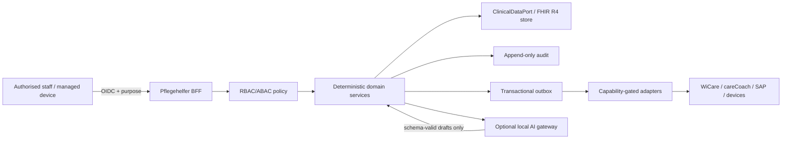

# Data flow

The browser receives role- and purpose-specific view models, never provider credentials. Production data stays inside the controlled environment except through approved integration paths.
